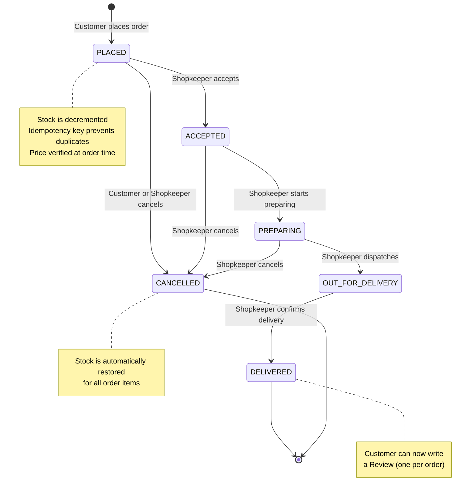
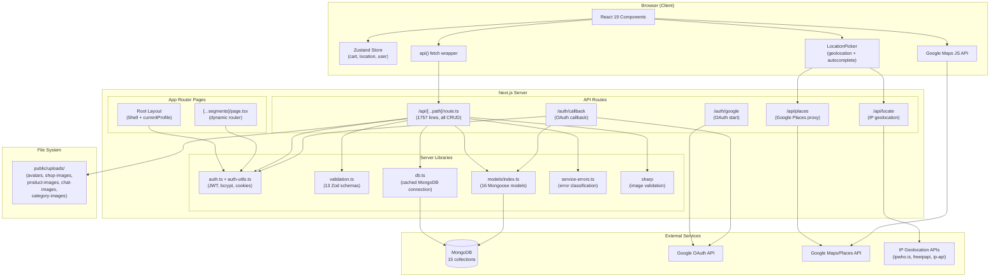
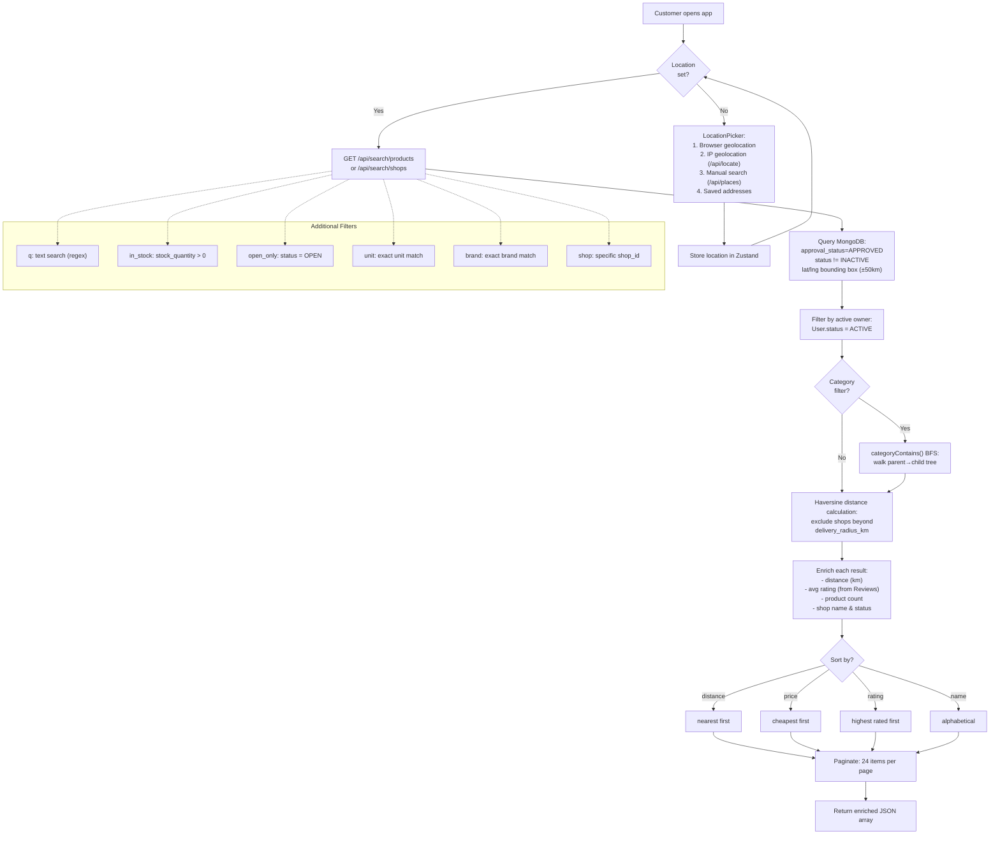
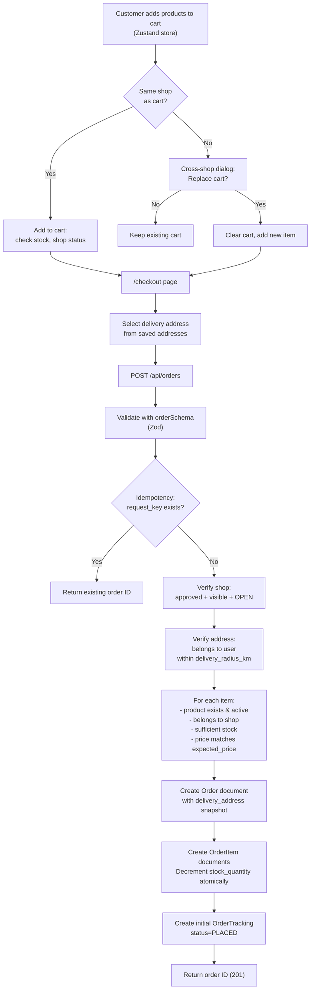
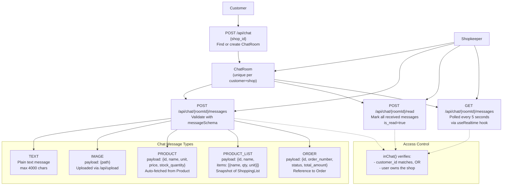
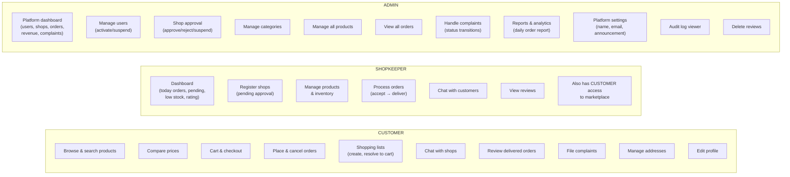
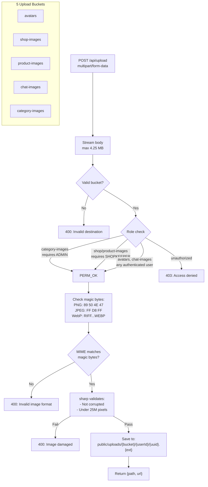
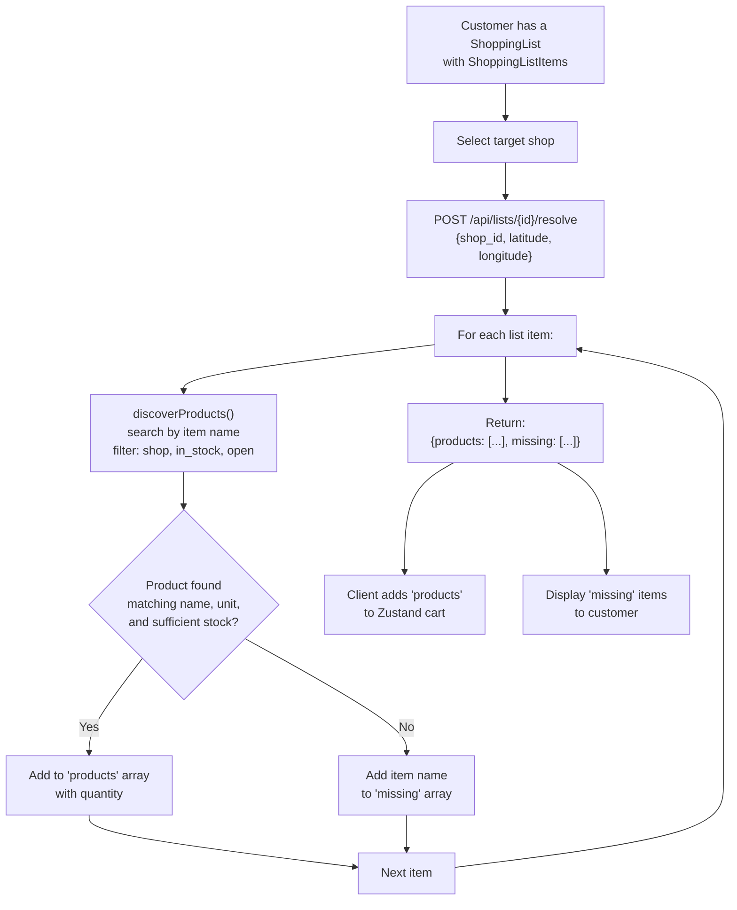

# 🛒 Kirana — Your Neighbourhood, Online

**Kirana** is a full-stack, hyperlocal marketplace web application built with **Next.js 16**, **React 19**, **MongoDB (Mongoose)**, and **TypeScript**. It connects customers with nearby *kirana* (neighbourhood grocery) shops, enabling product discovery, price comparison, order placement, real-time chat, shopping lists, reviews, complaints, and full admin/shopkeeper management — all with **zero delivery or handling fees**.

---

## Table of Contents

- [Features Overview](#features-overview)
- [Architecture](#architecture)
- [Tech Stack](#tech-stack)
- [Project Structure](#project-structure)
- [Data Models (MongoDB / Mongoose)](#data-models-mongodb--mongoose)
  - [Entity-Relationship Diagram](#entity-relationship-diagram)
  - [Order Lifecycle State Machine](#order-lifecycle-state-machine)
  - [Authentication Flow](#authentication-flow)
  - [System Architecture & Data Flow](#system-architecture--data-flow)
  - [Shop & Product Discovery Pipeline](#shop--product-discovery-pipeline)
  - [Order Placement Flow](#order-placement-flow)
  - [Chat System Architecture](#chat-system-architecture)
  - [User Role Access Matrix](#user-role-access-matrix)
  - [File Upload Pipeline](#file-upload-pipeline)
  - [Shopping List Resolve-to-Cart Flow](#shopping-list-resolve-to-cart-flow)
- [Authentication & Authorization](#authentication--authorization)
- [API Endpoints Reference](#api-endpoints-reference)
- [Client-Side State Management](#client-side-state-management)
- [UI Components Deep Dive](#ui-components-deep-dive)
- [Pages & Routing](#pages--routing)
- [Key Business Logic](#key-business-logic)
- [Google Maps & Location Services](#google-maps--location-services)
- [Validation Layer (Zod)](#validation-layer-zod)
- [Custom Hooks](#custom-hooks)
- [Database Seed Script](#database-seed-script)
- [Testing](#testing)
- [Security](#security)
- [Environment Variables](#environment-variables)
- [Setup & Installation](#setup--installation)
- [Running the App](#running-the-app)
- [Quality Checks](#quality-checks)
- [Demo Accounts](#demo-accounts)

---

## Features Overview

| Role | Features |
|---|---|
| **Customer** | Browse nearby shops · Search & filter products · Compare prices across shops · Add to cart & place orders · Shopping lists (with auto-resolve to cart) · Real-time chat with shops · Leave reviews · File complaints · Manage addresses · Google Maps location picker |
| **Shopkeeper** | Dashboard with live stats · Register & manage shops · Product & inventory management · Order lifecycle management (accept → prepare → deliver) · Chat with customers · View reviews |
| **Admin** | Platform dashboard with aggregate metrics · User management (activate/suspend) · Shop approval workflow · Category management · Order & complaint oversight · Platform settings · Reports & analytics · Audit logs |

---

## Architecture

```
┌──────────────────────────────────────────────────────┐
│                      Browser                         │
│  React 19 + Zustand store + Tailwind CSS v4          │
│  Google Maps JS API · Location picker                │
└──────────────────┬───────────────────────────────────┘
                   │  fetch → /api/*
┌──────────────────▼───────────────────────────────────┐
│               Next.js 16 (App Router)                │
│  Server Components · Route Handlers · RSC Auth       │
│  Catch-all API: /api/[...path]/route.ts              │
│  JWT auth (jose) · bcryptjs password hashing         │
│  sharp image processing · Zod validation             │
└──────────────────┬───────────────────────────────────┘
                   │  Mongoose ODM
┌──────────────────▼───────────────────────────────────┐
│                    MongoDB                           │
│  15 collections · indexes · geospatial queries       │
└──────────────────────────────────────────────────────┘
```

**Key architectural decisions:**
- **Single API route handler** — all CRUD operations are routed through one catch-all `[...path]/route.ts` (~1750 lines) that dispatches by URL segments and HTTP method.
- **No ORM migrations** — Mongoose schemas auto-create collections and indexes on first connection.
- **Custom JWT auth** — no third-party auth provider; bcryptjs for passwords, jose for JWT tokens, httpOnly cookies for sessions.
- **Polling-based realtime** — the `useRealtime` hook polls every 5 seconds instead of WebSockets, keeping the infrastructure simple.
- **Local file storage** — uploaded images are saved to `public/uploads/` and served as static assets.

---

## Tech Stack

| Layer | Technology | Purpose |
|---|---|---|
| Framework | Next.js 16 (App Router) | SSR, RSC, API routes |
| UI | React 19 | Component rendering |
| Language | TypeScript 5.7 | Type safety |
| Styling | Tailwind CSS v4 + shadcn/ui (New York) | Design system |
| Database | MongoDB + Mongoose 9 | Data persistence |
| Auth | jose (JWT) + bcryptjs | Token signing, password hashing |
| Validation | Zod 4 | Schema validation for all inputs |
| State | Zustand 5 | Client-side cart, location, user |
| Forms | react-hook-form + @hookform/resolvers | Form management & validation |
| Maps | @googlemaps/js-api-loader | Google Maps & Places integration |
| Images | sharp | Server-side image validation |
| Icons | lucide-react | Icon system |
| Testing | Playwright + Node test runner | E2E & unit tests |

---

## Project Structure

```
kirana/
├── src/
│   ├── app/                          # Next.js App Router
│   │   ├── layout.tsx                # Root layout (Shell + auth)
│   │   ├── page.tsx                  # Home page (→ HomePage component)
│   │   ├── error.tsx                 # Error boundary
│   │   ├── loading.tsx               # Loading skeleton
│   │   ├── not-found.tsx             # 404 page
│   │   ├── globals.css               # All CSS (~40KB, Tailwind v4 + custom)
│   │   ├── [...segments]/page.tsx    # Dynamic catch-all page router
│   │   ├── [[...segments]]/          # Optional catch-all (empty)
│   │   ├── api/
│   │   │   ├── [...path]/route.ts    # ★ Main API handler (~1750 lines)
│   │   │   ├── locate/route.ts       # IP geolocation endpoint
│   │   │   └── places/route.ts       # Google Places proxy
│   │   └── auth/
│   │       ├── google/route.ts       # Google OAuth initiation
│   │       ├── callback/route.ts     # Google OAuth callback
│   │       └── confirm/route.ts      # Legacy email confirm redirect
│   ├── components/
│   │   ├── shell.tsx                 # App shell (sidebar, nav, header, footer)
│   │   ├── discovery.tsx             # Home, search, compare pages
│   │   ├── product-card.tsx          # Product & shop card components
│   │   ├── shop-pages.tsx            # Shop detail & product detail pages
│   │   ├── account-pages.tsx         # Login, register, profile, addresses
│   │   ├── order-pages.tsx           # Cart, checkout, orders, order detail
│   │   ├── list-pages.tsx            # Shopping lists management
│   │   ├── chat-page.tsx             # Customer ↔ shop messaging
│   │   ├── management-pages.tsx      # Shopkeeper/admin CRUD tables
│   │   ├── platform-pages.tsx        # Platform settings, reports, complaints
│   │   ├── entity-form.tsx           # Generic CRUD form (shops/products/categories)
│   │   ├── location-picker.tsx       # Location selection + Google Places
│   │   ├── google-map.tsx            # Google Maps component
│   │   ├── feedback.tsx              # Toast, Loading, Empty, Failure states
│   │   └── ui/                       # shadcn/ui primitives
│   │       ├── button.tsx
│   │       ├── dialog.tsx
│   │       ├── input.tsx
│   │       └── skeleton.tsx
│   ├── hooks/
│   │   ├── use-query.ts              # Data fetching hook with refresh
│   │   └── use-realtime.ts           # Polling-based data refresh
│   ├── lib/
│   │   ├── models/index.ts           # ★ All Mongoose schemas & models (851 lines)
│   │   ├── types.ts                  # TypeScript interfaces for all entities
│   │   ├── validation.ts             # Zod schemas for every endpoint
│   │   ├── db.ts                     # MongoDB connection (cached singleton)
│   │   ├── auth.ts                   # Server-side auth helpers (currentProfile, requireRole)
│   │   ├── auth-utils.ts             # JWT signing/verification, cookie management
│   │   ├── store.ts                  # Zustand store (cart, location, owner)
│   │   ├── api-client.ts             # Client-side fetch wrapper
│   │   ├── service-errors.ts         # Error classification & user-friendly messages
│   │   ├── utils.ts                  # Formatting (money, date, label, distance, nextStatus)
│   │   └── brand.ts                  # Brand name constants & display logic
│   └── proxy.ts                      # Middleware pass-through
├── database/
│   └── scripts/
│       └── seed-mongo.ts             # Demo data seeder (450 lines)
├── tests/
│   ├── brand.test.ts                 # Brand name unit tests
│   ├── database.test.ts              # DB connection tests
│   ├── service-errors.test.ts        # Error handling tests
│   ├── validation.test.ts            # Zod schema tests
│   └── browser/
│       ├── smoke.spec.ts             # Basic smoke tests
│       ├── demo.spec.ts              # Full workflow E2E tests
│       ├── marketplace.spec.ts       # Marketplace integration tests
│       ├── branding.spec.ts          # Branding tests
│       └── security.spec.ts          # Security header tests
├── public/uploads/                   # User-uploaded images (gitignored)
├── .env.example                      # Environment variable template
├── next.config.ts                    # Next.js config (security headers, images)
├── playwright.config.ts              # Playwright test config
├── components.json                   # shadcn/ui config (New York style, stone base)
├── package.json                      # Dependencies & scripts
└── tsconfig.json                     # TypeScript config
```

---

## Data Models (MongoDB / Mongoose)

All models are defined in `src/lib/models/index.ts`. Each uses a `getModel()` helper to prevent re-compilation during Next.js hot-reload.

### Entity-Relationship Diagram

```mermaid
erDiagram
    User {
        ObjectId _id PK
        string name "2-100 chars"
        string email UK "lowercase, unique"
        string phone UK "sparse unique, 10-15 digits"
        enum role "CUSTOMER | SHOPKEEPER | ADMIN"
        string avatar_url "profile picture URL"
        string profile_image "synced with avatar_url"
        enum status "ACTIVE | INACTIVE | SUSPENDED"
        string password_hash "bcrypt 12 rounds, null for OAuth"
        string google_id UK "sparse unique, Google OAuth"
        Date created_at "auto"
        Date updated_at "auto"
    }

    Category {
        ObjectId _id PK
        string name UK "unique, max 100"
        string description "max 1000"
        string image_url "category icon"
        ObjectId parent_id FK "self-ref for hierarchy"
        Date created_at "auto"
        Date updated_at "auto"
    }

    Address {
        ObjectId _id PK
        ObjectId user_id FK "owner of this address"
        string label "Home, Office, etc. max 40"
        string full_address "max 500"
        float latitude "-90 to 90"
        float longitude "-180 to 180"
        string city "max 100"
        string state "max 100"
        string pincode "6-digit Indian PIN"
        boolean is_default "only one per user"
        Date created_at "auto"
        Date updated_at "auto"
    }

    Shop {
        ObjectId _id PK
        ObjectId owner_id FK "shopkeeper User._id"
        ObjectId category_id FK "primary shop category"
        string name "2-120 chars"
        string description "max 2000"
        string logo_url "shop logo image"
        string phone "max 20"
        string email "optional contact"
        ObjectId address_id FK "linked Address"
        string address "text address, max 500"
        float latitude "shop location"
        float longitude "shop location"
        float delivery_radius_km "0.01-50 km"
        string open_time "HH:MM format"
        string close_time "HH:MM format"
        enum status "OPEN | CLOSED | INACTIVE"
        enum approval_status "PENDING | APPROVED | REJECTED | SUSPENDED"
        Date created_at "auto"
        Date updated_at "auto"
    }

    Product {
        ObjectId _id PK
        ObjectId shop_id FK "belongs to Shop"
        ObjectId category_id FK "product category"
        string name "2-150 chars"
        string description "max 2000"
        string brand "max 100"
        string unit "1 kg, 500 ml, etc."
        float price "INR, 0-10M"
        int stock_quantity "0-1M, decremented on order"
        string image_url "primary product image"
        boolean is_active "soft-delete flag"
        Date created_at "auto"
        Date updated_at "auto"
    }

    ProductImage {
        ObjectId _id PK
        ObjectId product_id FK "parent Product"
        string image_url "image URL"
        boolean is_primary "one primary per product"
        Date created_at "auto"
    }

    ShoppingList {
        ObjectId _id PK
        ObjectId user_id FK "customer who created it"
        string name "list name, max 100"
        Date created_at "auto"
        Date updated_at "auto"
    }

    ShoppingListItem {
        ObjectId _id PK
        ObjectId list_id FK "parent ShoppingList"
        ObjectId product_id FK "optional linked Product"
        string name "item name, max 150"
        string product_name "synced with name via hook"
        int quantity "1-999"
        string unit "item, kg, etc."
        Date created_at "auto"
        Date updated_at "auto"
    }

    Order {
        ObjectId _id PK
        string order_number UK "auto LK-XXXX hex"
        ObjectId customer_id FK "who placed order"
        ObjectId shop_id FK "target shop"
        ObjectId address_id FK "delivery address ref"
        mixed delivery_address "snapshot of Address at order time"
        enum status "PLACED-ACCEPTED-PREPARING-OUT_FOR_DELIVERY-DELIVERED-CANCELLED"
        float total_amount "calculated from items"
        string notes "customer notes, max 2000"
        string request_key UK "idempotency per customer"
        Date created_at "auto"
        Date updated_at "auto"
    }

    OrderItem {
        ObjectId _id PK
        ObjectId order_id FK "parent Order"
        ObjectId product_id FK "product snapshot"
        string product_name "name + unit at order time"
        float unit_price "price at order time"
        int quantity "1-999"
        float total_price "unit_price x quantity"
    }

    OrderTracking {
        ObjectId _id PK
        ObjectId order_id FK "parent Order"
        string status "status at this point"
        string note "optional note, max 1000"
        ObjectId updated_by FK "User who changed status"
        Date created_at "timestamp of change"
    }

    Review {
        ObjectId _id PK
        ObjectId order_id FK "unique - one review per order"
        ObjectId customer_id FK "who wrote the review"
        ObjectId shop_id FK "shop being reviewed"
        int rating "1 to 5 stars"
        string comment "max 2000"
        Date created_at "auto"
        Date updated_at "auto"
    }

    Complaint {
        ObjectId _id PK
        ObjectId order_id FK "optional related order"
        ObjectId user_id FK "who filed complaint"
        ObjectId shop_id FK "optional related shop"
        string subject "max 150"
        string description "max 4000"
        enum status "OPEN | IN_PROGRESS | RESOLVED | CLOSED"
        Date created_at "auto"
        Date updated_at "auto"
    }

    ChatRoom {
        ObjectId _id PK
        ObjectId customer_id FK "customer in chat"
        ObjectId shop_id FK "shop in chat"
        Date created_at "auto"
        Date updated_at "last message time"
    }

    ChatMessage {
        ObjectId _id PK
        ObjectId chat_room_id FK "parent ChatRoom"
        ObjectId sender_id FK "User who sent message"
        string message "text content, max 4000"
        enum message_type "TEXT | IMAGE | PRODUCT | PRODUCT_LIST | ORDER"
        mixed payload "rich content: product details, list items, order ref"
        boolean is_read "read receipt"
        Date created_at "sent time"
    }

    AuditLog {
        ObjectId _id PK
        ObjectId actor_id FK "admin or system User"
        string resource "collection name"
        ObjectId resource_id "affected document ID"
        string action "CREATE | UPDATE | DELETE"
        mixed changes "before and after snapshots"
        Date created_at "action time"
    }

    PlatformSettings {
        ObjectId _id PK
        string marketplace_name "default: LocalKart"
        string support_email "admin contact"
        string announcement "global banner text"
        Date updated_at "last changed"
    }

    %% ═══════════════════════════════════════════
    %% USER RELATIONSHIPS (Customer / Shopkeeper / Admin)
    %% ═══════════════════════════════════════════

    User ||--o{ Address : "saves delivery addresses"
    User ||--o{ Shop : "owns as shopkeeper"
    User ||--o{ ShoppingList : "creates grocery lists"
    User ||--o{ Order : "places as customer"
    User ||--o{ Review : "writes after delivery"
    User ||--o{ Complaint : "files for support"
    User ||--o{ AuditLog : "admin actions logged"

    %% ═══════════════════════════════════════════
    %% CATEGORY HIERARCHY
    %% ═══════════════════════════════════════════

    Category |o--o{ Category : "parent has subcategories"
    Category ||--o{ Shop : "shop primary category"
    Category ||--o{ Product : "product category"

    %% ═══════════════════════════════════════════
    %% SHOP ECOSYSTEM
    %% ═══════════════════════════════════════════

    Shop |o--o| Address : "shop physical location"
    Shop ||--o{ Product : "shop inventory"
    Shop ||--o{ Order : "receives customer orders"
    Shop ||--o{ Review : "rated by customers"
    Shop ||--o{ Complaint : "complaints about shop"
    Shop ||--o{ ChatRoom : "customer conversations"

    %% ═══════════════════════════════════════════
    %% PRODUCT & IMAGES
    %% ═══════════════════════════════════════════

    Product ||--o{ ProductImage : "gallery images"
    Product ||--o{ OrderItem : "purchased in orders"
    Product |o--o{ ShoppingListItem : "referenced in lists"

    %% ═══════════════════════════════════════════
    %% SHOPPING LIST SYSTEM
    %% ═══════════════════════════════════════════

    ShoppingList ||--o{ ShoppingListItem : "list contains items"

    %% ═══════════════════════════════════════════
    %% ORDER LIFECYCLE
    %% ═══════════════════════════════════════════

    Order ||--o{ OrderItem : "line items with prices"
    Order ||--o{ OrderTracking : "status change history"
    Order |o--|| Review : "one review per delivered order"
    Order |o--o{ Complaint : "complaints about order"
    Order }o--|| Address : "delivered to address"

    %% ═══════════════════════════════════════════
    %% CHAT SYSTEM
    %% ═══════════════════════════════════════════

    ChatRoom ||--o{ ChatMessage : "message thread"
    User ||--o{ ChatRoom : "customer participates"
    User ||--o{ ChatMessage : "sends messages"
    User ||--o{ OrderTracking : "shopkeeper/admin updates status"
```



> **Notation:** `||--o{` one-to-many · `|o--o{` optional one-to-many · `|o--||` optional one-to-one · `PK` primary key · `FK` foreign key · `UK` unique key

---

### Order Lifecycle State Machine



---

### Authentication Flow

```mermaid
flowchart TB
    subgraph "Email/Password Auth"
        A1["/register page"] --> A2["POST /api/auth/register"]
        A2 --> A3["Validate with registerSchema"]
        A3 --> A4["Check email uniqueness"]
        A4 --> A5["bcrypt hash password (12 rounds)"]
        A5 --> A6["Create User document"]
        A6 --> A7["Sign JWT (HS256, 7d expiry)"]
        A7 --> A8["Set httpOnly cookie 'kirana-auth'"]

        B1["/login page"] --> B2["POST /api/auth/login"]
        B2 --> B3["Find User by email"]
        B3 --> B4["bcrypt verify password"]
        B4 --> B5["Check status != SUSPENDED"]
        B5 --> A7
    end

    subgraph "Google OAuth"
        C1["Click 'Continue with Google'"] --> C2["GET /auth/google"]
        C2 --> C3["Redirect to Google consent screen"]
        C3 --> C4["GET /auth/callback?code=xxx"]
        C4 --> C5["Exchange code for access_token"]
        C5 --> C6["Fetch Google userinfo"]
        C6 --> C7{"User exists\nby google_id?"}
        C7 -- Yes --> C9["Use existing User"]
        C7 -- No --> C8{"Email exists\nin DB?"}
        C8 -- Yes --> C10["Link google_id\nto existing User"]
        C8 -- No --> C11["Create new CUSTOMER User"]
        C10 --> C9
        C11 --> C9
        C9 --> C12["Sign JWT + set cookie"]
        C12 --> C13["Redirect to / or /shopkeeper"]
    end

    subgraph "Request Authorization"
        D1["Any API request"] --> D2["Read 'kirana-auth' cookie"]
        D2 --> D3["Verify JWT with jose"]
        D3 --> D4["Load User from MongoDB"]
        D4 --> D5{"status ==\nSUSPENDED?"}
        D5 -- Yes --> D6["403 Forbidden"]
        D5 -- No --> D7{"Role in\nallowed roles?"}
        D7 -- No --> D8["403 Access denied"]
        D7 -- Yes --> D9["Return Profile object"]
    end

    subgraph "Logout"
        E1["POST /api/auth/logout"] --> E2["Clear 'kirana-auth' cookie (maxAge=0)"]
        E2 --> E3["Clear Zustand store (cart, location)"]
    end
```



---

### System Architecture & Data Flow



---

### Shop & Product Discovery Pipeline



---

### Order Placement Flow



---

### Chat System Architecture



---

### User Role Access Matrix



---

### File Upload Pipeline



---

### Shopping List Resolve-to-Cart Flow



### 1. `User`
| Field | Type | Description |
|---|---|---|
| `name` | String (2–100) | Display name |
| `email` | String (unique, lowercase) | Login identifier |
| `phone` | String (unique, sparse) | Phone number |
| `role` | Enum | `CUSTOMER`, `SHOPKEEPER`, or `ADMIN` |
| `avatar_url` | String | Profile picture URL |
| `profile_image` | String | Synced with `avatar_url` via pre-save hook |
| `status` | Enum | `ACTIVE`, `INACTIVE`, or `SUSPENDED` |
| `password_hash` | String | bcrypt hash (null for Google OAuth users) |
| `google_id` | String (unique, sparse) | Google OAuth subject ID |

**Indexes:** `email` (unique), `phone` (unique sparse), `google_id` (unique sparse)

### 2. `Category`
| Field | Type | Description |
|---|---|---|
| `name` | String (unique, max 100) | Category name |
| `description` | String (max 1000) | Description text |
| `image_url` | String | Category icon/image |
| `parent_id` | ObjectId → Category | Hierarchical parent |

**Indexes:** `parent_id`

### 3. `Address`
| Field | Type | Description |
|---|---|---|
| `user_id` | ObjectId → User | Owner |
| `label` | String (max 40) | "Home", "Office", etc. |
| `full_address` | String (max 500) | Full text address |
| `latitude` / `longitude` | Number | Geo-coordinates |
| `city`, `state`, `pincode` | String | Location parts |
| `is_default` | Boolean | Default delivery address |

**Indexes:** `user_id`

### 4. `Shop`
| Field | Type | Description |
|---|---|---|
| `owner_id` | ObjectId → User | Shopkeeper who owns it |
| `category_id` | ObjectId → Category | Primary category |
| `name` | String (2–120) | Shop name |
| `description` | String (max 2000) | Shop description |
| `logo_url` | String | Shop logo |
| `address` | String | Text address |
| `latitude` / `longitude` | Number | Geo-coordinates |
| `delivery_radius_km` | Number (0.01–50) | Max delivery distance |
| `open_time` / `close_time` | String (HH:MM) | Operating hours |
| `status` | Enum | `OPEN`, `CLOSED`, or `INACTIVE` |
| `approval_status` | Enum | `PENDING`, `APPROVED`, `REJECTED`, `SUSPENDED` |

**Indexes:** `owner_id`, `address_id`, `(latitude, longitude)`, `name` (text), `category_id`

### 5. `Product`
| Field | Type | Description |
|---|---|---|
| `shop_id` | ObjectId → Shop | Parent shop |
| `category_id` | ObjectId → Category | Product category |
| `name` | String (2–150) | Product name |
| `description` | String (max 2000) | Description |
| `brand` | String (max 100) | Brand name |
| `unit` | String (max 40) | e.g. "1 kg", "500 ml" |
| `price` | Number (0–10M) | Price in INR |
| `stock_quantity` | Number (0–1M) | Available stock |
| `image_url` | String | Primary product image |
| `is_active` | Boolean | Soft-delete flag |

**Indexes:** `shop_id`, `category_id`, `name` (text)

### 6. `ProductImage`
Stores multiple images per product with a `is_primary` flag.

### 7. `ShoppingList` + `ShoppingListItem`
User-created grocery lists with items that can optionally reference a `Product`. The `ShoppingListItem` has a pre-save hook that syncs `name` and `product_name`.

### 8. `Order`
| Field | Type | Description |
|---|---|---|
| `order_number` | String (unique) | Auto-generated `LK-XXXX` format |
| `customer_id` | ObjectId → User | Who placed the order |
| `shop_id` | ObjectId → Shop | Target shop |
| `delivery_address` | Mixed | Snapshot of address at order time |
| `status` | Enum | `PLACED` → `ACCEPTED` → `PREPARING` → `OUT_FOR_DELIVERY` → `DELIVERED` (or `CANCELLED`) |
| `total_amount` | Number | Calculated total |
| `notes` | String | Customer notes |
| `request_key` | String (unique per customer) | Idempotency key to prevent duplicate orders |

**Indexes:** `(customer_id, created_at)`, `(shop_id, created_at)`, `status`, `created_at`, `(customer_id, request_key)` (unique)

### 9. `OrderItem`
Line items within an order: `product_id`, `product_name`, `unit_price`, `quantity`, `total_price`.

### 10. `OrderTracking`
Status change log: `order_id`, `status`, `note`, `updated_by`, `created_at`.

### 11. `Review`
One review per order (enforced by unique `order_id`). Fields: `order_id`, `customer_id`, `shop_id`, `rating` (1–5), `comment`.

### 12. `Complaint`
Customer support tickets: `order_id`, `user_id`, `shop_id`, `subject`, `description`, `status` (OPEN → IN_PROGRESS → RESOLVED → CLOSED).

### 13. `ChatRoom`
Unique `(customer_id, shop_id)` pair. One chat room per customer-shop relationship.

### 14. `ChatMessage`
Messages in chat rooms. Supports types: `TEXT`, `IMAGE`, `PRODUCT`, `PRODUCT_LIST`, `ORDER` — each with a typed `payload`.

### 15. `AuditLog`
Admin action log: `actor_id`, `resource`, `resource_id`, `action`, `changes`.

### 16. `PlatformSettings` (Singleton)
Global settings: `marketplace_name`, `support_email`, `announcement`.

### Utility Functions in Models
- **`distanceKm(lat1, lng1, lat2, lng2)`** — Haversine formula for distance between two coordinates.
- **`categoryContains(parentId, childId)`** — BFS traversal to check if a category is a descendant of another.
- **`ensurePlatformSettings()`** — Lazy-creates the singleton settings document.

---

## Authentication & Authorization

### Password Auth Flow
1. **Register** (`POST /api/auth/register`) → Validates via `registerSchema` → Hashes password with bcryptjs (12 rounds) → Creates `User` document → Signs JWT → Sets `kirana-auth` httpOnly cookie (7-day expiry).
2. **Login** (`POST /api/auth/login`) → Finds user by email → Verifies password hash → Checks account status → Signs JWT → Sets cookie.
3. **Logout** (`POST /api/auth/logout`) → Clears the auth cookie.

### Google OAuth Flow
1. `GET /auth/google` → Redirects to Google OAuth consent screen.
2. Google redirects to `GET /auth/callback` with authorization code.
3. Callback exchanges code for access token → Fetches user profile from Google → Finds or creates `User` (links Google ID to existing email accounts) → Signs JWT → Sets cookie → Redirects to `/` or `/shopkeeper`.

### JWT Token Structure
- Algorithm: HS256
- Payload: `{ sub: userId }`
- Expiry: 7 days
- Secret: `JWT_SECRET` env var

### Role-Based Access
The `actor(roles?)` function in the API route:
1. Reads JWT from cookie → Finds user in DB
2. Checks `SUSPENDED` status → throws 403
3. Checks role against allowed roles → throws 403
4. Returns the `Profile` object

Server components use `requireRole(roles)` which redirects to `/login` or `/` if unauthorized.

### Key Auth Functions

| Function | File | Purpose |
|---|---|---|
| `hashPassword(password)` | `auth-utils.ts` | bcrypt hash with 12 rounds |
| `verifyPassword(password, hash)` | `auth-utils.ts` | bcrypt compare |
| `signToken(userId)` | `auth-utils.ts` | Create HS256 JWT |
| `verifyToken(token)` | `auth-utils.ts` | Verify & decode JWT |
| `setAuthCookie(userId)` | `auth-utils.ts` | Sign JWT + set httpOnly cookie |
| `getAuthUserId()` | `auth-utils.ts` | Read cookie → verify → return userId |
| `clearAuthCookie()` | `auth-utils.ts` | Expire the auth cookie |
| `currentProfile()` | `auth.ts` | Get current user's Profile (or null) |
| `requireRole(roles)` | `auth.ts` | Server-side role gate (redirects on failure) |
| `configured()` | `auth.ts` | Returns true if `MONGODB_URI` is set |

---

## API Endpoints Reference

All endpoints are handled by the catch-all route at `src/app/api/[...path]/route.ts`. The URL pattern is `/api/{resource}/{target}/{action}`.

### Public Endpoints (No Auth)

| Method | Path | Description |
|---|---|---|
| `GET` | `/api/categories` | List all categories |
| `GET` | `/api/platform-settings` | Get marketplace name, support email, announcement |
| `GET` | `/api/search/shops?lat=&lng=&...` | Discover nearby shops |
| `GET` | `/api/search/products?lat=&lng=&...` | Search products across nearby shops |
| `GET` | `/api/shops/{id}?lat=&lng=` | Get single shop details (if within delivery radius) |
| `GET` | `/api/products/{id}?lat=&lng=` | Get single product details |
| `GET` | `/api/shop-reviews/{shopId}` | List reviews for a shop |
| `GET` | `/api/locate` | IP-based geolocation |
| `GET` | `/api/places?input=&placeId=&geocode=` | Google Places proxy |

### Auth Endpoints

| Method | Path | Description |
|---|---|---|
| `POST` | `/api/auth/register` | Create account |
| `POST` | `/api/auth/login` | Sign in |
| `POST` | `/api/auth/logout` | Sign out |
| `POST` | `/api/auth/reset-password` | Change password (authenticated) |
| `POST` | `/api/auth/update-email` | Change email (authenticated) |
| `GET` | `/auth/google` | Initiate Google OAuth |
| `GET` | `/auth/callback` | Google OAuth callback |

### Customer Endpoints (Auth Required)

| Method | Path | Description |
|---|---|---|
| `GET` | `/api/profile` | Get own profile |
| `POST` | `/api/profile` | Update name, phone, avatar |
| `GET` | `/api/addresses` | List own addresses |
| `POST` | `/api/addresses` | Create address |
| `POST` | `/api/addresses/{id}` | Update address |
| `DELETE` | `/api/addresses/{id}` | Delete address |
| `GET` | `/api/lists` | List shopping lists with items |
| `POST` | `/api/lists` | Create shopping list |
| `POST` | `/api/lists/{id}` | Rename shopping list |
| `DELETE` | `/api/lists/{id}` | Delete shopping list + items |
| `POST` | `/api/lists/{id}/resolve` | Auto-match list items to shop products |
| `POST` | `/api/list-items` | Add item to list |
| `POST` | `/api/list-items/{id}` | Update list item |
| `DELETE` | `/api/list-items/{id}` | Remove list item |
| `GET` | `/api/orders` | List own orders (with items & tracking) |
| `GET` | `/api/orders/{id}` | Get order details |
| `POST` | `/api/orders` | Place new order |
| `POST` | `/api/orders/{id}` | Update order status (cancel) |
| `GET` | `/api/chat` | List chat rooms with unread counts |
| `GET` | `/api/chat/{roomId}/messages` | Get messages in room |
| `POST` | `/api/chat` | Open/get chat room with a shop |
| `POST` | `/api/chat/{roomId}/messages` | Send message |
| `POST` | `/api/chat/{roomId}/read` | Mark messages as read |
| `GET` | `/api/reviews` | List own reviews |
| `POST` | `/api/reviews` | Submit review for delivered order |
| `DELETE` | `/api/reviews/{id}` | Delete review (admin only) |
| `GET` | `/api/complaints` | List own complaints |
| `POST` | `/api/complaints` | File a complaint |
| `POST` | `/api/upload` | Upload image (multipart/form-data) |

### Shopkeeper Endpoints

| Method | Path | Description |
|---|---|---|
| `GET` | `/api/stats` | Dashboard stats (today's orders, pending, low stock, etc.) |
| `GET` | `/api/manage/shops` | List own shops |
| `POST` | `/api/manage/shops` | Create shop (status: PENDING) |
| `POST` | `/api/manage/shops/{id}` | Update shop details |
| `GET` | `/api/manage/products` | List own products |
| `POST` | `/api/manage/products` | Create product |
| `POST` | `/api/manage/products/{id}` | Update product |
| `DELETE` | `/api/manage/products/{id}` | Soft-delete product (is_active=false) |

### Admin Endpoints

| Method | Path | Description |
|---|---|---|
| `GET` | `/api/stats` | Platform-wide stats |
| `GET` | `/api/reports?days=` | Daily order report (up to 90 days) |
| `GET` | `/api/manage/users` | List all users |
| `POST` | `/api/manage/users/{id}` | Activate/suspend user |
| `GET` | `/api/manage/shops` | List all shops |
| `POST` | `/api/manage/shops/{id}` | Approve/reject/suspend shop |
| `GET` | `/api/manage/categories` | List categories (paginated) |
| `POST` | `/api/manage/categories` | Create category |
| `POST` | `/api/manage/categories/{id}` | Update category |
| `DELETE` | `/api/manage/categories/{id}` | Delete category |
| `GET` | `/api/manage/audit_logs` | View audit trail |
| `POST/PATCH` | `/api/platform-settings` | Update marketplace settings |
| `POST` | `/api/complaints/{id}` | Update complaint status |

---

## Client-Side State Management

### Zustand Store (`src/lib/store.ts`)

The store is persisted to `localStorage` under key `"localkart"`.

| State | Type | Purpose |
|---|---|---|
| `location` | `Location \| null` | User's selected delivery location |
| `owner` | `string \| null` | Current user's ID (clears cart on user change) |
| `shopId` | `string \| null` | Shop the cart belongs to |
| `shopName` | `string` | Display name of cart's shop |
| `items` | `CartItem[]` | Cart items array |

### Store Actions

| Action | Logic |
|---|---|
| `setLocation(location)` | Updates delivery location |
| `setOwner(owner)` | If user changes, clears entire cart |
| `add(product, replace?)` | Returns `"added"`, `"cross-shop"`, or `"unavailable"`. Checks stock, shop status. If different shop, prompts to replace cart |
| `quantity(id, q)` | Updates quantity. Removes item if `q < 1`. Caps at stock/999 |
| `clear()` | Empties cart, resets shop |

### API Client (`src/lib/api-client.ts`)

```typescript
api<T>(path, body?, method?): Promise<T>
```
Wrapper around `fetch("/api/" + path)` — auto-detects GET vs POST by presence of body, parses JSON response, throws on error.

---

## UI Components Deep Dive

### `Shell` — App Layout (`shell.tsx`)
- **Server → Client bridge**: Root layout passes `profile` (from `currentProfile()`) and `connected` flag.
- **Sidebar navigation**: Three sets of nav links — customer, shopkeeper, admin — auto-selected by route and role.
- **Header**: Mobile menu toggle + `LocationPicker` + sign-in link + cart badge.
- **Profile section**: Avatar (initials), name, role, logout button.
- **Connection banner**: Shown when MongoDB is not configured.
- **Context**: Provides `ProfileContext` — consumed via `useProfile()` hook.

### `HomePage` / `SearchPage` / `ComparePage` (`discovery.tsx`)
- **HomePage**: Hero section + category grid + nearby shops + price comparison table + map + shopping lists + active order banner.
- **SearchPage**: Full-text search with filters (category, in-stock, open-only, sort). Tab switching between products and shops.
- **ComparePage** (`kind="compare"`): Side-by-side price comparison with unit and brand filters.

### `ProductCard` / `ShopCard` (`product-card.tsx`)
- Displays product image, name, price (INR format), shop name, distance badge.
- "Add to cart" button with cross-shop confirmation dialog.
- Shop card shows rating, product count, status badge, distance.

### `CartPage` / `OrdersPage` / `OrderPage` (`order-pages.tsx`)
- **Cart**: Line items with quantity +/- controls, running total, proceed to checkout.
- **Checkout**: Address selection (from saved addresses) + order placement with idempotency key.
- **Orders**: List view with status badges, filters by status.
- **Order Detail**: Item breakdown, delivery address, tracking timeline, review/complaint actions.

### `AccountPages` (`account-pages.tsx`)
- **AuthPage**: Login form, registration form (with password strength validation), Google OAuth button.
- **ProfilePage**: Edit name, phone, avatar (with image upload).
- **AddressesPage**: CRUD for delivery addresses with location picker integration.

### `ChatPage` (`chat-page.tsx`)
- Room list with unread badge counts.
- Message thread supporting TEXT, PRODUCT, PRODUCT_LIST, ORDER, IMAGE message types.
- Rich message cards for products (with price, stock) and orders (with status).
- Auto-polls every 5 seconds for new messages via `useRealtime`.

### `ManagementPages` (`management-pages.tsx`)
- Generic CRUD table for shops, products, categories, users, reviews, complaints.
- Inline status toggles (approve/reject shops, activate/suspend users).
- `EntityForm` modal for create/edit operations.

### `LocationPicker` (`location-picker.tsx`)
- Three modes: browser geolocation, IP-based geolocation, manual search.
- Google Places autocomplete (when enabled).
- Saved addresses dropdown for logged-in users.

### `GoogleMap` (`google-map.tsx`)
- Full Google Maps integration with `@googlemaps/js-api-loader`.
- Shop markers on the map, click-to-view shop details.
- Delivery radius visualization.

### `Feedback` (`feedback.tsx`)
- **ToastProvider/useToast**: Global toast notification system (success/error, 4.5s auto-dismiss).
- **Loading**: Skeleton grid (3 cards).
- **Empty**: Empty state with icon and message.
- **Failure**: Error state with retry button.

---

## Pages & Routing

The app uses a **catch-all dynamic route** at `src/app/[...segments]/page.tsx` that maps URL segments to components:

| URL | Component | Auth Required |
|---|---|---|
| `/` | `HomePage` | No |
| `/login`, `/register` | `AuthPage` | No |
| `/search` | `SearchPage` | No |
| `/compare` | `SearchPage (compare mode)` | No |
| `/shops` | `SearchPage (shops mode)` | No |
| `/shops/{id}` | `ShopPage` | No |
| `/products/{id}` | `ProductPage` | No |
| `/cart` | `CartPage` | No |
| `/checkout` | `CartPage (checkout mode)` | Customer |
| `/profile` | `ProfilePage` | Any role |
| `/addresses` | `AddressesPage` | Customer |
| `/shopping-lists` | `ShoppingListsPage` | Customer |
| `/orders` | `OrdersPage` | Any role |
| `/orders/{id}` | `OrderPage` | Any role |
| `/chat` | `ChatPage` | Customer |
| `/reviews` | `ManagementPage (reviews)` | Customer |
| `/complaints` | `ComplaintsPage` | Customer |
| `/shopkeeper` | `DashboardPage` | Shopkeeper |
| `/shopkeeper/shop` | `ManagementPage (shops)` | Shopkeeper |
| `/shopkeeper/products` | `ManagementPage (products)` | Shopkeeper |
| `/shopkeeper/inventory` | `ManagementPage (inventory)` | Shopkeeper |
| `/shopkeeper/orders` | `OrdersPage` | Shopkeeper |
| `/shopkeeper/chat` | `ChatPage` | Shopkeeper |
| `/shopkeeper/reviews` | `ManagementPage (reviews)` | Shopkeeper |
| `/admin` | `DashboardPage` | Admin |
| `/admin/users` | `ManagementPage (users)` | Admin |
| `/admin/shops` | `ManagementPage (shops)` | Admin |
| `/admin/categories` | `ManagementPage (categories)` | Admin |
| `/admin/products` | `ManagementPage (products)` | Admin |
| `/admin/orders` | `OrdersPage` | Admin |
| `/admin/reviews` | `ManagementPage (reviews)` | Admin |
| `/admin/complaints` | `ManagementPage (complaints)` | Admin |
| `/admin/reports` | `ReportsPage` | Admin |
| `/admin/settings` | `PlatformSettingsPage` | Admin |

---

## Key Business Logic

### Shop Discovery (`discoverShops`)
1. Queries shops with `approval_status: "APPROVED"` and `status ≠ "INACTIVE"`.
2. Filters by latitude/longitude bounding box (±50km / 111°).
3. Filters by active owner (user status = "ACTIVE").
4. Applies category filter with hierarchy traversal (`categoryContains`).
5. Computes Haversine distance; excludes shops beyond their `delivery_radius_km`.
6. Calculates average rating from reviews.
7. Counts active products per shop.
8. Sorts by distance/rating/name and paginates (24 per page).

### Product Discovery (`discoverProducts`)
1. Finds all eligible shops (same filtering as above).
2. Queries products in those shops with `is_active: true`.
3. Applies text search, in-stock filter, unit/brand filters.
4. Category filter with hierarchy.
5. Enriches with shop info (name, status, distance, rating).
6. Sorts by price/distance/rating/name; paginates.

### Order Placement
1. Validates all inputs with `orderSchema`.
2. **Idempotency**: Checks `request_key` — if order already exists, returns existing ID.
3. Verifies shop is approved, visible, and OPEN.
4. Validates delivery address belongs to user and is within shop's delivery radius.
5. Verifies each product: belongs to shop, is active, has sufficient stock, price hasn't changed.
6. Creates `Order`, `OrderItem` records and initial `OrderTracking` entry.
7. **Atomically decrements stock** for each product.
8. Returns order ID.

### Order Status Transitions
```
PLACED → ACCEPTED → PREPARING → OUT_FOR_DELIVERY → DELIVERED
  ↓         ↓           ↓
CANCELLED CANCELLED  CANCELLED (only by shopkeeper/admin)
```
- Customers can cancel only `PLACED` or `ACCEPTED` orders.
- Shopkeepers/admins follow the state machine.
- On cancellation, stock is automatically restored.

### Shopping List Resolution (`lists/{id}/resolve`)
Matches list items to in-stock products at a specific shop:
1. For each list item, searches available products by name, unit, and product_id.
2. Returns `{ products: [...], missing: [...] }` — found products go to cart, missing items are reported.

### Chat System
- Customer opens chat with a shop → creates/finds `ChatRoom`.
- Messages support rich types: TEXT, PRODUCT (auto-fetches product details), PRODUCT_LIST (snapshot of shopping list), ORDER (order reference), IMAGE (uploaded image path).
- Both parties can mark messages as read.
- 5-second polling on the client side refreshes message count and content.

### Distance Calculation
The Haversine formula (`distanceKm`) computes great-circle distance between two lat/lng coordinates, used for:
- Filtering shops within delivery radius
- Sorting by proximity
- Validating delivery address is reachable

---

## Google Maps & Location Services

### IP Geolocation (`/api/locate`)
Cascading fallback strategy:
1. **ipwho.is** — primary
2. **freeipapi.com** — fallback
3. **ip-api.com** — secondary fallback
4. **Hardcoded Gwalior** — default for local/MP IPs

### Places Proxy (`/api/places`)
Server-side proxy to Google APIs (keeps API key server-side):
- **Autocomplete**: `?input=query` → Google Place Autocomplete
- **Place Details**: `?placeId=xxx` → lat/lng + formatted address
- **Geocode**: `?geocode=query` → cascading: Google Geocoding → Find Place → Nominatim (OpenStreetMap)

### Google Map Component
- Uses `@googlemaps/js-api-loader` for dynamic loading.
- Shows shop markers on the map.
- Supports delivery radius circles.
- Integrates with the location picker for address selection.

---

## File Upload Pipeline

`POST /api/upload` handles image uploads:

1. **Size limit**: 4 MB max (streamed with `limitedBody`).
2. **Format validation**: Magic bytes check for JPEG, PNG, WebP.
3. **MIME verification**: File type must match magic bytes.
4. **Image integrity**: `sharp` verifies the image is not corrupted (25M pixel limit).
5. **Storage**: Saves to `public/uploads/{bucket}/{userId}/{uuid}.{ext}`.
6. **Buckets**: `avatars`, `shop-images`, `product-images`, `chat-images`, `category-images`.
7. **Access control**: Category images require admin; shop/product images require shopkeeper.

---

## Validation Layer (Zod)

All input validation uses Zod schemas defined in `src/lib/validation.ts`:

| Schema | Used For |
|---|---|
| `registerSchema` | User registration (name, email, password with strength rules, phone, role) |
| `addressSchema` | Address CRUD (label, coordinates, city, state, pincode) |
| `shopSchema` | Shop CRUD (name, description, coordinates, hours, radius, status) |
| `productSchema` | Product CRUD (name, description, brand, unit, price, stock) |
| `orderSchema` | Order placement (shop_id, address_id, items with expected prices, idempotency key) |
| `messageSchema` | Chat messages (room_id, type, message, reference_id) |
| `listItemSchema` | Shopping list items (name, quantity, unit, product_id) |
| `categorySchema` | Category CRUD (name, description, parent_id) |
| `platformSettingsSchema` | Platform settings (marketplace_name, support_email, announcement) |
| `reviewSchema` | Review submission (order_id, shop_id, rating 1–5, comment) |
| `complaintSchema` | Complaint filing (subject, description, optional order/shop) |
| `productImageSchema` | Product image records |
| `profileSchema` | Profile updates (name, phone, avatar_url) |
| `searchSchema` | Search/discovery queries (coordinates, query, filters, sorting, pagination) |

**Password rules**: Min 10 chars, max 128, must include lowercase, uppercase, and number.

---

## Custom Hooks

### `useQuery<T>(path)` — `src/hooks/use-query.ts`
Generic data-fetching hook:
- Returns `{ data, error, loading, refresh }`.
- Calls `api<T>(path)` (GET) on mount and when path/revision changes.
- Supports cancellation on unmount.
- `refresh()` triggers re-fetch by incrementing revision counter.
- Pass `null` as path to skip fetching.

### `useDebounce<T>(value, delay)` — `src/hooks/use-query.ts`
Debounces a value by `delay` ms (default 300). Used for search input throttling.

### `useRealtime(table, onChange, filter?)` — `src/hooks/use-realtime.ts`
Polling-based refresh hook:
- Calls `onChange()` every 5 seconds.
- Uses `useRef` to always call the latest callback.
- Named `table` parameter is for future WebSocket compatibility but currently only drives the `useEffect` dependency.

---

## Database Seed Script

`database/scripts/seed-mongo.ts` creates comprehensive demo data:

- **8 categories**: Grocery, Dairy, Bakery, Stationery, Flowers, Household, Personal care, Snacks (with hierarchy).
- **10 shops**: 5 in Gwalior, 5 in Bengaluru (with varied statuses: open, closed, pending approval).
- **60 products**: 6 products per shop (Tata Salt, Milk, Bread, Sugar, Atta, Notebook) with varied prices.
- **5 shopkeepers**, **2 customers**, **1 admin** — all with the same password from `SEED_PASSWORD`.
- **Addresses**, **shopping lists**, **chat rooms**, **messages**, **orders**, **reviews**, **complaints** — all pre-populated for testing.

**Run**: `npm run seed` (requires `MONGODB_URI` and `SEED_PASSWORD` in `.env.local`).

Deterministic IDs are generated using SHA-256 hashes for idempotent re-seeding.

---

## Testing

### Unit Tests (Node test runner + tsx)
```powershell
npm test
```
- `brand.test.ts` — Brand name display logic
- `database.test.ts` — DB connection and model tests
- `service-errors.test.ts` — Error classification
- `validation.test.ts` — Zod schema validation

### Browser Tests (Playwright)
```powershell
npm run test:browser       # Smoke tests
npm run test:integration   # Marketplace flows
npm run test:demo          # Full demo workflow
npm run test:security      # Security header checks
```

Playwright config:
- Runs against `http://localhost:3100` (auto-starts production build).
- Desktop Chrome + Pixel 7 (mobile) projects.
- Uses local Chrome installation if available.

---

## Security

### HTTP Security Headers (`next.config.ts`)
Applied to all routes:
- `X-Content-Type-Options: nosniff`
- `X-Frame-Options: DENY`
- `Referrer-Policy: strict-origin-when-cross-origin`
- `Permissions-Policy: geolocation=(self), camera=(), microphone=()`
- `Content-Security-Policy: frame-ancestors 'none'; object-src 'none'; base-uri 'self'`
- `X-Powered-By` header is removed.

### API Security
- **CSRF Protection**: Mutations verify `Origin` header and `sec-fetch-site` to block cross-site requests.
- **Request size limits**: JSON body capped at 100KB, file uploads at 4.25MB.
- **Image validation**: Magic bytes + MIME type + sharp integrity check.
- **Input validation**: All inputs validated with Zod (SQL injection is N/A; NoSQL injection mitigated by strict schemas).
- **Password hashing**: bcrypt with 12 salt rounds.
- **JWT cookies**: httpOnly, secure (in production), sameSite=lax.
- **Role enforcement**: Every endpoint checks user role before proceeding.
- **Idempotent orders**: Duplicate orders prevented by `request_key`.
- **Soft-delete**: Products are deactivated, not deleted, preserving order history.

---

## Environment Variables

| Variable | Required | Description |
|---|---|---|
| `MONGODB_URI` | ✅ | MongoDB connection string |
| `JWT_SECRET` | ✅ | Secret for JWT signing (use a long random string in production) |
| `NEXT_PUBLIC_SITE_URL` | ✅ | Public URL (e.g., `http://localhost:3000`) |
| `NEXT_PUBLIC_GOOGLE_MAPS_API_KEY` | Optional | Google Maps JavaScript API key |
| `NEXT_PUBLIC_GOOGLE_PLACES_ENABLED` | Optional | Enable Places autocomplete (`true`/`false`) |
| `GOOGLE_CLIENT_ID` | Optional | Google OAuth client ID |
| `GOOGLE_CLIENT_SECRET` | Optional | Google OAuth client secret |
| `SEED_PASSWORD` | For seeding | Password for demo accounts (min 10 chars) |
| `PLAYWRIGHT_EXECUTABLE_PATH` | For testing | Custom browser path for Playwright |
| `DEFAULT_CITY` | Optional | Override IP geolocation default city |

---

## Setup & Installation

### Prerequisites
- **Node.js 22+**
- **npm**
- **MongoDB** (local or remote instance)
- **Google Maps API key** (optional, for maps features)
- **Google OAuth credentials** (optional, for Google sign-in)

### Steps

```powershell
# 1. Clone the repository
git clone https://github.com/Xabhi0811/Kirana.git
cd kirana

# 2. Install dependencies
npm install

# 3. Create .env.local from the template
cp .env.example .env.local
# Edit .env.local with your MongoDB URI, JWT secret, and optional API keys

# 4. (Optional) Seed demo data
npm run seed

# 5. Start development server
npm run dev
```

Open [http://localhost:3000](http://localhost:3000).

---

## Running the App

| Command | Description |
|---|---|
| `npm run dev` | Start Next.js dev server with hot-reload |
| `npm run build` | Production build |
| `npm run start` | Start production server |
| `npm run seed` | Populate MongoDB with demo data |

---

## Quality Checks

```powershell
npm run lint           # ESLint
npm run typecheck      # TypeScript type checking (tsc --noEmit)
npm test               # Unit tests (Node test runner)
npm run test:browser   # Playwright smoke tests
npm run test:demo      # Full E2E demo tests
npm run test:security  # Security header tests
npm run format         # Prettier formatting
```

---

## Demo Accounts

After running `npm run seed`, the following accounts are available (all sharing the `SEED_PASSWORD`):

| Role | Email |
|---|---|
| Admin | `admin@localkart.test` |
| Shopkeeper 1 | `shopkeeper1@localkart.test` |
| Shopkeeper 2 | `shopkeeper2@localkart.test` |
| Customer 1 | `aarav@localkart.test` |
| Customer 2 | `isha@localkart.test` |

---

## License

Private project.
