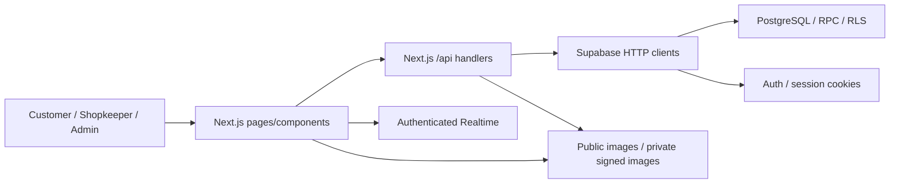
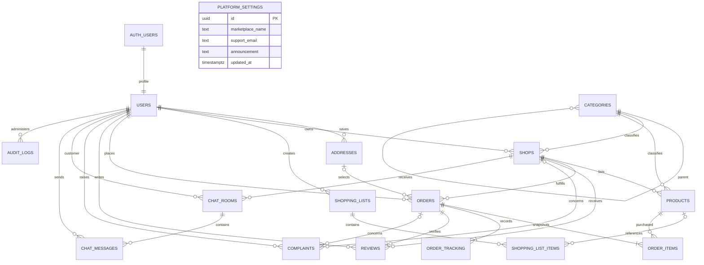

# Kirana

## 1. Project Overview

Kirana connects customers with nearby shops for product discovery, price comparison, shopping lists, orders and private chat. Shopkeepers manage catalogs and fulfillment; administrators moderate the marketplace. This MVP has **zero delivery/handling fees and no payment system**: gateways, COD accounting, transactions and refunds are outside scope.

## 2. Key Features

| Role       | Implemented features                                                                                                                                                                                                                                |
| ---------- | --------------------------------------------------------------------------------------------------------------------------------------------------------------------------------------------------------------------------------------------------- |
| Customer   | Registration/login, confirmation/recovery, profile/avatar, addresses, location, nearby discovery, search/variant comparison, shopping lists, cart/checkout, tracking/cancellation, verified reviews, complaints, private text/structured/image chat |
| Shopkeeper | Multiple shops, contacts/location/hours/radius/logo, approval workflow, products/images/categories, inventory/prices, fulfillment, chat, reviews, dashboard                                                                                         |
| Admin      | Dashboard, user suspension, shop moderation, categories/products/orders/reviews/complaints, audit logs, public settings, bounded order reports and CSV export                                                                                       |
| System     | Supabase Auth, PostgreSQL transactions/constraints/RLS, role checks, authenticated Realtime/polling, public/private Storage, validated and bounded APIs                                                                                             |

Implemented features are distinct from verification of every external service; see sections 22, 27 and 28.

## 3. Technology Stack

| Area        | Actual implementation                                                                                                      |
| ----------- | -------------------------------------------------------------------------------------------------------------------------- |
| Application | Next.js App Router, React, strict TypeScript; resolved versions in `package-lock.json`                                     |
| UI          | Tailwind CSS 4/PostCSS, Radix Dialog/Slot, Lucide, shadcn-style components, class-variance-authority, clsx, tailwind-merge |
| Forms/state | React Hook Form, Zod/resolvers, Zustand                                                                                    |
| Backend     | Node.js Next.js handlers, Supabase SSR/JavaScript clients, Sharp image decoding                                            |
| Services    | Supabase PostgreSQL, Auth, Storage, Realtime                                                                               |
| Tooling     | npm, ESLint/Next ESLint, Prettier, TypeScript/types, tsx, Supabase CLI, pg                                                 |
| Tests       | Node test runner, PGlite PostgreSQL, Playwright                                                                            |

All declared dependencies are retained: each serves source imports, framework rendering, styles, types, scripts or tests. React DOM and build/type packages remain necessary without direct application imports. No dependency was upgraded or removed. Offline installation validates lockfile/install consistency, not current vulnerability advisories.

## 4. System Architecture



This is one full-stack Next.js app. `src/app/api/[...path]/route.ts` implements APIs; `src/app/auth/` handles callbacks; `src/proxy.ts` refreshes sessions. Runtime uses Supabase HTTP clients. Direct PostgreSQL through `pg` is development tooling only.

## 5. Project Structure

```text
Kirana/
|-- src/
|   |-- app/                    Pages, layouts, CSS, API and Auth handlers
|   |-- components/             Feature screens and shared ui/ primitives
|   |-- hooks/                  Queries/debounce/realtime
|   |-- lib/                    Validation/types/state/API/Auth/Supabase
|   `-- proxy.ts                Session refresh
|-- database/
|   |-- scripts/                Six migration/diagnostic/seed/native DB tools
|   |-- supabase/
|   |   |-- migrations/         Seven immutable ordered migrations
|   |   |-- tests/integrity.sql Read-only integrity checks
|   |   |-- config.toml         Local Supabase configuration
|   |   `-- local-postgres-bootstrap.sql
|   `-- evidence/audit-evidence.json  Historical schema export
|-- supabase/certs/             CA path retained for environment compatibility
|-- tests/                     Unit/SQL regressions and browser/ suites
|-- archive/prototype/         Standalone HTML/CSS/JS design reference
|-- README.md                  Single project documentation file
|-- AGENTS.md, CLAUDE.md        Next.js-generated tooling instructions
`-- package*.json, .env.example and essential framework/test configuration
```

The requested `frontend/`/`backend/` split is not imposed: pages/API, configuration, environment loading, tests and deployment share one application root. Keeping the established `src/app` arrangement avoids an unnecessary deployment/architecture migration. Database files are grouped separately; `database/supabase/` preserves CLI conventions through `--workdir database`. No empty architectural folders were added.

`AGENTS.md` and `CLAUDE.md` are tooling instructions, not project documentation. The installed `node_modules/next/dist/server/lib/generate-agent-files.js` generates both. Vendor Markdown is outside first-party documentation cleanup.

## 6. User Roles

Signup accepts `CUSTOMER` and `SHOPKEEPER`; only trusted administration provisions `ADMIN`. Customers own private addresses/lists/orders. Keepers manage their own shops/products/orders. Admins moderate platform resources; admin status does not grant private address/list/chat access. Suspended login returns a clear 403 and clears the failed session. Database guards also restrict suspended accounts.

## 7. Customer Workflow

Register/confirm → login → choose browser/manual/saved-address location → discover shops → search/compare brand/package variants → list or single-shop cart → checkout with address → track fulfillment → review delivered order or raise complaint → chat with shopkeeper.

Public pages: `/`, `/search`, `/compare`, `/shops`, `/shops/:id`, `/products/:id`, `/cart`. Account pages: `/profile`, `/addresses`, `/shopping-lists`, `/checkout`, `/orders`, `/orders/:id`, `/chat`, `/reviews`, `/complaints`. Auth pages: `/register`, `/login`, `/forgot-password`, `/reset-password`.

## 8. Shopkeeper Workflow

Register → create shop/location/radius → admin approval → manage products/inventory → receive/accept/prepare/dispatch/deliver orders → customer chat. Listings can be prepared while approval is pending.

Routes: `/shopkeeper`, `/shopkeeper/shop`, `/shopkeeper/products`, `/shopkeeper/inventory`, `/shopkeeper/orders`, `/shopkeeper/chat`, `/shopkeeper/reviews`, `/shopkeeper/settings`.

## 9. Admin Workflow

Dashboard → users → shop approvals/moderation → categories/products → orders/reviews → complaints → audit records/reports → public settings. Self-suspension through the API is rejected. Settings do not override Auth security.

Routes: `/admin`, `/admin/users`, `/admin/shops`, `/admin/products`, `/admin/categories`, `/admin/orders`, `/admin/reviews`, `/admin/complaints`, `/admin/reports`, `/admin/settings`. Reports cover UTC order-creation cohorts and current statuses over 1–90 days (UI: 7/30/90). Delivered order value is not payment revenue.

## 10. Database / ER Architecture

There are 16 public application tables. `public.users` stores profiles/roles/status; `auth.users` owns credentials. No separate public `profiles`, `roles`, `carts` or payment tables exist. Cart persistence is browser-side. Private helpers and migration tracking live in `private`; historical rate counters were removed incrementally.

| Entity / table                         | Main fields and relationships                                                                                  | Access / mutation                                                           |
| -------------------------------------- | -------------------------------------------------------------------------------------------------------------- | --------------------------------------------------------------------------- |
| Auth user / `auth.users`               | Credentials; 1:1 profile by UUID                                                                               | Supabase Auth; signup trigger accepts customer/keeper, never admin metadata |
| Profile / `users`                      | name, email, phone, role, status, avatar, timestamps; FK Auth user CASCADE                                     | Own active profile; admin status; guarded role/email changes                |
| Category / `categories`                | name unique, description, image, optional parent FK RESTRICT                                                   | Public read; admin CRUD; cycle trigger                                      |
| Address / `addresses`                  | user FK CASCADE; label, address, city/state/PIN, coordinates, default                                          | Customer-owned; `save_address` serializes default changes                   |
| Shop / `shops`                         | owner/category FKs; contact/location/radius/hours; operating and approval states                               | Approved public read; active owner management; admin moderation             |
| Product / `products`                   | shop/category FKs; name/brand/unit/price/stock/image/active                                                    | Visible public catalogue; owner/admin writes                                |
| Shopping list / `shopping_lists`       | user FK CASCADE, name                                                                                          | Own customer                                                                |
| List item / `shopping_list_items`      | list FK CASCADE, optional product FK, name/unit/quantity                                                       | Through own list; active customer writes                                    |
| Cart / browser state                   | Account-scoped persistent single-shop items                                                                    | Zustand, cleared on owner change; server revalidates                        |
| Order / `orders`                       | customer/shop/address FKs; address SET NULL on deletion; immutable delivery snapshot, total/status/request key | Own customer, owning shopkeeper, admin; narrow RPC writes                   |
| Order item / `order_items`             | order FK CASCADE, product FK; name/price/quantity/total snapshots                                              | Parent-order visibility, RPC insert                                         |
| Tracking / `order_tracking`            | order FK CASCADE, updater FK, status/note/event time                                                           | Parent-order visibility, transition RPC                                     |
| Review / `reviews`                     | unique order FK, customer/shop FKs, rating 1–5, comment                                                        | Delivered own order only; public visible shop; admin remove                 |
| Complaint / `complaints`               | user FK; optional order/shop FKs; subject/text/status                                                          | Own customer create/read; admin resolution                                  |
| Chat room / `chat_rooms`               | unique customer + shop FKs, updated time                                                                       | Customer/owning keeper only; `open_chat`                                    |
| Message / `chat_messages`              | room FK CASCADE, sender FK, text/type/payload/read/time                                                        | Participant read; authorized `send_message`/`read_messages`                 |
| Audit / `audit_logs`                   | nullable actor FK, resource/id/action/before-after/time                                                        | Trigger writes; admin read                                                  |
| Settings / `platform_settings`         | Singleton UUID; name/support email/announcement/time                                                           | Public read; admin audited update                                           |
| Storage / `storage.objects`, `buckets` | Owner-prefixed paths; private image path includes room                                                         | Four public buckets; chat participant-only; role/path upload policies       |



Application tables have UUID primary keys. Constraints cover unique email/normalized phone, one default address/customer, one room/customer/shop, one review/order, request idempotency, coordinates, stock/amounts, snapshot totals, category cycles and states. Products belong to shops. Orders snapshot prices/names/delivery addresses; deleting a saved address does not erase order history. Public shop addresses remain separate from private customer addresses.

| Migration in `database/supabase/migrations/` | Purpose                                                                           |
| -------------------------------------------- | --------------------------------------------------------------------------------- |
| `202609150001_localkart.sql`                 | Core schema/RLS/constraints/triggers/orders/chat/Storage/Realtime                 |
| `202609150002_er_alignment.sql`              | Normalized phone uniqueness/format, line totals, FK indexes                       |
| `202609150003_feature_completion.sql`        | Settings, admin reports/audits, category images                                   |
| `202609160001_remove_rate_limits.sql`        | Removes project-owned mutation counters/limits                                    |
| `202609160002_audit_security.sql`            | Shop insertion visibility, caller-only account status, dangerous-grant revocation |
| `202609160003_product_name_sort.sql`         | Name sorting before pagination                                                    |
| `202609160004_tracking_event_time.sql`       | Event timestamps and scoped historical demo timeline repair                       |

Migration filenames/contents are immutable. The custom runner checks installed checksums and applies pending files in filename order. CLI/SQL Editor installations should retain their original tracking method; the custom runner refuses untracked nonempty schemas. The historical evidence JSON records definitions/counts at its `checkedAt` timestamp, not current live state.

## 11. Authentication & Authorization

Supabase owns credentials/sessions; server helpers verify users and active roles. RLS and guarded triggers enforce record ownership and prevent escalation. Registration requires a 10–128 character password with uppercase/lowercase/digit and a 10–15 digit phone with optional leading `+`. Phone uniqueness does not verify ownership.

Configure `/auth/confirm` and `/auth/callback` redirects on your deployed origin and working email/SMTP. The local configuration disables confirmation for development; hosted policy can differ. Register and verify a trusted account before deliberately bootstrapping the first admin in the trusted SQL editor:

```sql
UPDATE public.users SET role = 'ADMIN'
WHERE email = 'your-admin-email@example.com';
```

Existing Auth-only users need a reviewed profile backfill. Signup metadata must never grant ADMIN.

## 12. Chat Architecture

Private customer/shop rooms support `TEXT`, `IMAGE`, `PRODUCT`, `PRODUCT_LIST`, `ORDER`. RPCs derive immutable structured payloads from authorized records. Read receipts update other-participant messages. The browser initializes Realtime auth before subscribing, waits for readiness, and cleans channels/timers; a 15-second polling fallback remains. Orders/tracking also subscribe to changes. Private image signed URLs require participant membership, including for admins.

## 13. Geolocation

Explicit browser permission, validated manual coordinates and saved addresses supply location. Shops publish coordinates/radius. Database discovery filters approval/activity/distance/category/variants/availability before pagination; checkout revalidates delivery eligibility. Shop details link to OpenStreetMap. Mocked-location tests do not verify physical GPS accuracy.

## 14. Orders

Account-scoped Zustand persistence holds a single-shop cart/location. Switching shops requires replacement confirmation; lists may span shops. `place_order` validates current prices/stock/ownership/address/radius, locks products and atomically reserves stock and writes totals/items/tracking. Reusing the request UUID prevents duplicate reservations.

Lifecycle: `PLACED → ACCEPTED → PREPARING → OUT_FOR_DELIVERY → DELIVERED`; authorized early cancellation/rejection uses `CANCELLED` and restores stock once. One review is allowed per delivered order. Complaints can concern orders, shops or the platform, with `OPEN`, `IN_PROGRESS`, `RESOLVED` states.

## 15. Storage

| Bucket                          | Visibility / upload authority                            |
| ------------------------------- | -------------------------------------------------------- |
| `avatars`                       | Public; active user's own path                           |
| `shop-images`, `product-images` | Public; shopkeeper-owned upload path                     |
| `category-images`               | Public; admin uploads                                    |
| `chat-images`                   | Private; sender-owned path containing authorized room ID |

Uploads require matching PNG/JPEG/WebP MIME/signatures and successful Sharp decoding, at most 4 MiB and 25 million decoded pixels. SVG is rejected. Responses contain a path/public URL, or null URL for private chat. RLS protects paths/membership. URL columns are not Storage FKs; automatic orphan-object cleanup is absent. Stored historical demo artwork may retain old labels; future generated artwork uses Kirana.

## 16. Security

All application tables enable RLS. Role/ownership/suspension guards, fixed-search-path RPCs, FKs/checks and stock locks protect operations. API roles cannot TRUNCATE tables; RLS alone does not stop that privilege. Admin changes are audited. Runtime never uses a service-role key.

APIs enforce bounded bodies, Zod/UUID validation, same-origin mutations and sanitized errors. Next.js sends anti-framing/content-type/referrer/geolocation/limited CSP headers. Project mutation rate limits were intentionally removed; hosted Auth limits remain independent. These controls are not complete production security certification.

No application source, SQL behavior, RLS, Auth, UI, order or realtime logic is changed by this organization pass. Database reset/reseeding and user-data cleanup are outside its scope.

## 17. Environment Variables

Keep values in ignored root `.env.local` or deployment secret configuration. Names only:

| Variable                               | Scope / purpose                                        |
| -------------------------------------- | ------------------------------------------------------ |
| `NEXT_PUBLIC_SUPABASE_URL`             | Required public Supabase HTTP endpoint                 |
| `NEXT_PUBLIC_SUPABASE_PUBLISHABLE_KEY` | Required public publishable/legacy anon key            |
| `NEXT_PUBLIC_SITE_URL`                 | Public app origin for Auth redirects                   |
| `NEXT_PUBLIC_GOOGLE_MAPS_API_KEY`      | Restricted browser key for Maps JavaScript and Places  |
| `NEXT_PUBLIC_GOOGLE_PLACES_ENABLED`    | Set to `true` only after Places API (New) is authorized |
| `DIRECT_URL`                           | Server-only session PostgreSQL tooling connection      |
| `SUPABASE_DB_CA_FILE`                  | Tooling trusted CA certificate path                    |
| `SUPABASE_SERVICE_ROLE_KEY`            | Privileged legacy seeder/registration integration only |
| `SEED_PASSWORD`                        | Legacy development seeder password                     |
| `RUN_REMOTE_TESTS`                     | Explicit hosted registration integration opt-in        |
| `PLAYWRIGHT_EXECUTABLE_PATH`           | Browser executable override                            |
| `CI`                                   | Playwright server reuse behavior                       |
| `NODE_ENV`                             | Framework mode/demo seeder production guard            |

Never expose private credentials through `NEXT_PUBLIC_`. `DATABASE_URL` is not consumed. A PostgreSQL connection cannot replace the Supabase HTTP endpoint. Encode special password characters. `supabase/certs/prod-ca-2021.crt` stays at its existing path for environment compatibility; it is a public CA, not a private key.

## Google Authentication

Kirana uses Google OAuth through the existing Supabase Auth client. Email/password authentication remains available. The shared `/auth/callback` route exchanges the PKCE code for the normal cookie session, verifies that the existing `public.users` profile was created, rejects suspended profiles, and redirects according to the database role. New OAuth identities follow the database trigger's safe default and become `CUSTOMER`; Google metadata cannot grant `SHOPKEEPER` or `ADMIN`.

Configuration is provider-side; the OAuth client secret must not be placed in this repository or in a `NEXT_PUBLIC_` variable:

1. In Google Cloud, create a Web application OAuth client. Add the Supabase project's callback URL shown on the Supabase Google provider page (normally `https://<project-ref>.supabase.co/auth/v1/callback`) as an authorized redirect URI.
2. In Supabase Dashboard → Authentication → Providers → Google, enable Google and store the OAuth Client ID and Client Secret there.
3. In Supabase Authentication URL configuration, set the Site URL to the deployed Kirana origin and allow `http://localhost:3000/auth/callback` for local development plus the equivalent callback path on each real production origin. Do not invent or wildcard an untrusted production domain.
4. Set `NEXT_PUBLIC_SITE_URL` to the matching Kirana origin. Restart the development server after environment changes.

The local application port is 3000. The Google button cannot complete sign-in until both an OAuth Client ID and OAuth Client Secret are configured in Supabase; a Google Maps API key is unrelated and cannot substitute for them. Provider cancellation and callback/profile failures return a sanitized login-page message. For OAuth troubleshooting, verify the exact Supabase callback URI, allowed Kirana redirect URLs, provider consent-screen status, and the user's database profile/status.

## Google Maps

Maps are an optional visualization and location-selection layer over Kirana's existing browser geolocation, manual fields, stored coordinates, nearby-shop RPCs, and authoritative database delivery-radius checks. They appear in the location chooser, address editor, shop editor, nearby-shop results, and shop details. Address search uses the current `PlaceAutocompleteElement` and requests only formatted address, coordinates, and address components. If Google is unavailable, manual addresses/coordinates and all core marketplace workflows remain usable.

Enable only these Google Cloud APIs for the Maps project:

- Maps JavaScript API
- Places API (New)

Create a browser API key and set `NEXT_PUBLIC_GOOGLE_MAPS_API_KEY` in ignored `.env.local` and the deployment environment. Apply an **HTTP referrers** application restriction for `http://localhost:3000/*` during local development and the real HTTPS production origin(s). Apply API restrictions for only the two APIs above. Billing must be active for the Google Cloud project. Do not use an OAuth client secret, Supabase service-role key, or unrestricted server credential as the browser key.

Address autocomplete is disabled by default, which keeps maps and manual location selection usable when Places is not configured. After enabling **Places API (New)** (`places.googleapis.com`) in the same Google Cloud project, adding it to the browser key's API restrictions, confirming the referrer restriction and billing, set `NEXT_PUBLIC_GOOGLE_PLACES_ENABLED=true` and restart/rebuild the app. Leave it `false` if only map selection is required.

The map code is loaded on demand only when a map component is rendered; Places is loaded only for address/location selection. No Directions, Distance Matrix, Street View, or separate Geocoding API is used. If a map reports an unavailable/configuration message, check the key variable, billing, enabled APIs, referrer restrictions, browser network/CSP errors, and restart Next.js after changing the public build-time variable.

## 18. Installation

Requires Node.js 22+, npm and development Supabase (hosted or full local stack). Substitute the actual repository URL:

```sh
git clone <repository-url> Kirana
cd Kirana
npm ci
```

Create `.env.local` from `.env.example` only if absent, then configure section 17. PowerShell:

```powershell
if (!(Test-Path -LiteralPath .env.local)) { Copy-Item .env.example .env.local }
```

Apply pending migrations using section 19, optionally seed development fixtures, and run `npm run dev`. Open `http://localhost:3000`. Use `npm.cmd`/`npx.cmd` when PowerShell execution policy blocks wrappers. There is no separate backend installation.

## 19. Supabase Setup

**Hosted:** configure public URL/key, Auth origin/redirects and SMTP. `npm run db:check` checks HTTP services; `npm run db:inspect` reads schema metadata. For an empty/new tracked installation configure the session connection/CA, then `npm run db:migrate`. Apply all seven files once in order. Existing databases receive only pending migrations through their established method; do not reset/replay history.

The custom runner rejects transaction-pooler port 6543, project/checksum mismatches, untracked nonempty schemas and initial installations with existing Auth accounts. Use the session connection on port 5432. SQL Editor users should apply each pending file transactionally. Do not edit installed migrations.

**Full local Supabase:** start a Docker-compatible engine:

```sh
npm run db:start
npx supabase --workdir database migration up --local
```

Use that stack's public URL/key in root environment. Configured ports: API 54321, PostgreSQL 54322, Studio 54323, inbox 54324. SQL seeding is disabled; use deliberate development seeders. Migrations install buckets/policies and publish orders/tracking/messages. `npm run db:reset` is retained for disposable installations; **it destroys local data and was not used here**.

**Native Windows PostgreSQL:** optional schema development only. Extract binaries to `.local-postgres/pgsql`; run `npm run local:db:setup`, `local:db:start`, `local:db:status`, `local:db:stop` (all with `npm run`). Setup applies pending checksum-tracked migrations and refuses untracked nonempty databases. Loopback port 54329, database `localkart`, SCRAM credentials in ignored `.local-postgres/credentials.json`, data/logs in `.local-postgres/`.

```powershell
& .\.local-postgres\pgsql\bin\psql.exe -h 127.0.0.1 -p 54329 -U postgres -d localkart
```

The native bootstrap supplies development Auth/Storage dependency schemas and UID helpers only. It provides no Auth HTTP/JWT verification, uploaded-object storage or Realtime. Never apply it to managed Supabase or expose the UID helper as authentication. Native setup does not change the app's backend configuration.

## 20. Demo Accounts

`npm run seed:demo -- --allow-remote --project=<development-project-reference>` uses direct PostgreSQL, trusted CA and the public Supabase client. It rejects production mode and requires explicit target confirmation. It reuses deterministic fixtures/credentials and preserves existing stock/order progression; designated demo role/status/artwork remain managed fixtures. Run one seeder at a time; never target production.

Six roles: admin, two keepers, two active customers, one suspended customer. Existing `demo.*@localkart.test` identities and generated shared password are in ignored `.demo-data.json`; passwords are not documented. Baseline includes eight categories/eight shops, 72 standard products plus one low-stock product, Home/Office addresses, populated/empty lists, every order state, reviews/complaints and five chat types. Live tests can increase counts.

The older `npm run seed` uses a service-role key and seed password, with `--allow-remote` required remotely. It provisions five keepers/ten shops/eight categories/60 products/customers/admin and related fixtures. **It can reset demo stock/prices**; both seeders remain because their workflows differ.

Walkthrough: choose Bengaluru `12.9784, 77.6408`; browse Demo Neighbour Store, compare package variants, resolve Weekly Essentials, check out using Home/Office; fulfill in a separate keeper session, then review. Open both chats and send all five message types. Create/moderate a shop, resolve complaints and inspect admin reports/audits. Suspended login should return 403.

## 21. Running the Application

| Command                                                                      | Purpose                                                                 |
| ---------------------------------------------------------------------------- | ----------------------------------------------------------------------- |
| `npm run dev`                                                                | Development port 3000                                                   |
| `npm run build`, `npm run start`                                             | Build frontend/API together; serve production                           |
| `npm run typecheck`, `npm run lint`                                          | TypeScript / ESLint                                                     |
| `npm run format`                                                             | Writes formatted source/database scripts/tests/config                   |
| `npm test`                                                                   | Node unit/SQL regressions                                               |
| `npm run test:browser`                                                       | Desktop/mobile smoke                                                    |
| `npm run test:integration`                                                   | Desktop registration integration; prerequisite-gated                    |
| `npm run test:demo`, `npm run test:security`                                 | Desktop live workflows / RLS/API/Storage                                |
| `npx playwright test`                                                        | Full desktop/mobile matrix                                              |
| `npm run db:check`, `npm run db:inspect`                                     | Read-only HTTP / PostgreSQL diagnostics                                 |
| `npm run db:migrate`                                                         | Apply pending tracked migrations                                        |
| `npm run db:start`, `npm run db:reset`                                       | Local Supabase start / destructive disposable reset                     |
| `npm run local:db:setup`                                                     | Native cluster initialization and pending migrations                    |
| `npm run local:db:start`, `npm run local:db:status`, `npm run local:db:stop` | Native cluster lifecycle                                                |
| `npm run seed`, `npm run seed:demo`                                          | Development fixture tools; see section 20                               |
| `npx tsx database/scripts/audit-diagnostics.ts`                              | Metadata/integrity export and rolled-back demo shop-insert reproduction |

Audit diagnostics requires the demo keeper/CA configuration and writes `database/evidence/audit-evidence.json`. Inspect timestamps/diffs before treating it as new evidence; it does not apply migrations or reset data.

## 22. Testing

| Retained file                         | Classification / coverage                                                                                                                                                 |
| ------------------------------------- | ------------------------------------------------------------------------------------------------------------------------------------------------------------------------- |
| tests/brand.test.ts                   | Unit/regression: legacy aliases and custom-name preservation                                                                                                              |
| tests/validation.test.ts              | Unit/regression: registration/cart/coordinates/hours/settings                                                                                                             |
| tests/service-errors.test.ts          | Unit/regression: Auth/database error mapping                                                                                                                              |
| tests/database.test.ts                | SQL/security/integration: all migrations, RLS, constraints/indexes, discovery, orders/stock/idempotency/snapshots, chat/Storage, reports/audits, suspension/shop creation |
| tests/browser/smoke.spec.ts           | Browser smoke: navigation/overflow/location/cart/forms; two API-fixture cases                                                                                             |
| tests/browser/branding.spec.ts        | Browser regression: public and role/default settings branding                                                                                                             |
| tests/browser/demo.spec.ts            | Live customer/keeper/admin, real chat events/images, location/catalog                                                                                                     |
| tests/browser/security.spec.ts        | Live API/RLS/security: isolation/forgery, sessions, images/signed expiry, stock concurrency                                                                               |
| tests/browser/marketplace.spec.ts     | Registration-to-review integration; gated prerequisites                                                                                                                   |
| database/supabase/tests/integrity.sql | Eleven read-only consistency checks; expected zero violations                                                                                                             |

All nine test files and integrity SQL are retained; none is a redundant/debug experiment. PGlite executes real PostgreSQL migrations with external-schema fixtures; it does not emulate hosted Auth/email/Storage HTTP/Realtime. Smoke API fixtures do not prove backend health.

Build first. Playwright starts production port 3100 and uses installed Windows Chrome, `PLAYWRIGHT_EXECUTABLE_PATH`, or installed Chromium (`npx playwright install chromium`). Run browser suites sequentially; output and fixtures are shared. Screenshots/traces/reports stay ignored under `test-results/`/`playwright-report/`.

Demo/security tests mutate designated development fixtures and can retain labeled orders/messages/audit records; temporary CRUD fixtures are cleaned by tests. Never run against production. Security suite collection requires `.env.local` and `.demo-data.json`. Registration integration needs service-role credentials and explicit remote opt-in; skips are not passes. Confirmed demo users do not prove mailbox delivery.

## 23. API Documentation

All table paths have `/api` prefix. SSR cookies identify users and RLS remains authoritative. JSON is used except multipart uploads. Responses are direct objects/arrays, not a common data wrapper. Most successful operations return 200; order/message creation returns 201. Updates generally use POST; only settings supports PATCH.

| Method       | Route                                               | Purpose                            | Auth / role                                                                    | Input                                                           | Output / tables                              |
| ------------ | --------------------------------------------------- | ---------------------------------- | ------------------------------------------------------------------------------ | --------------------------------------------------------------- | -------------------------------------------- |
| POST         | `/auth/register`                                    | Register customer or keeper        | Public; CUSTOMER/SHOPKEEPER only                                               | name/email/phone/password/role                                  | Auth + profile trigger; confirmation message |
| POST         | `/auth/login`                                       | Sign in                            | Public                                                                         | email/password                                                  | Profile + session cookies; Auth/users        |
| POST         | `/auth/logout`                                      | Sign out                           | Session                                                                        | `{}`                                                            | session removed                              |
| POST         | `/auth/resend-confirmation`                         | Resend confirmation                | Public                                                                         | email                                                           | Provider delivery request                    |
| POST         | `/auth/forgot-password`                             | Request recovery email             | Public                                                                         | email                                                           | Provider reset request                       |
| POST         | `/auth/reset-password`                              | Set new password                   | Authenticated                                                                  | password                                                        | Auth update                                  |
| POST         | `/auth/update-email`                                | Request email change               | Authenticated                                                                  | email                                                           | Confirmation request; Auth sync trigger      |
| GET, POST    | `/profile`                                          | Read/update own profile            | Active own user                                                                | profile name/phone/avatar on POST                               | `users` row                                  |
| GET          | `/categories`                                       | Browse categories                  | Public                                                                         | page                                                            | `categories[]`                               |
| GET          | `/platform-settings`                                | Read public settings               | Public                                                                         | none                                                            | singleton public settings                    |
| POST, PATCH  | `/platform-settings`                                | Update public settings             | Admin                                                                          | marketplace_name/support_email/announcement                     | `platform_settings`; audited                 |
| GET          | `/search/shops`                                     | Find nearby shops                  | Public                                                                         | lat/lng/q/category/open_only/sort/page                          | eligible shops + distance/rating             |
| GET          | `/search/products`                                  | Search/compare listings            | Public                                                                         | lat/lng/q/category/brand/unit/in_stock/open_only/shop/sort/page | eligible product listings                    |
| GET          | `/shops/:id`                                        | Read eligible shop                 | Public visible shop                                                            | UUID + lat/lng                                                  | shop + delivery eligibility                  |
| GET          | `/products/:id`                                     | Read eligible product              | Public visible product                                                         | UUID + lat/lng                                                  | product + eligible shop                      |
| GET          | `/shop-reviews/:id`                                 | Read verified shop reviews         | Public visible shop                                                            | shop UUID                                                       | verified reviews                             |
| GET, POST    | `/addresses`, POST `/addresses/:id`                 | List/save addresses                | Customer owner                                                                 | address schema                                                  | `save_address` UUID                          |
| DELETE       | `/addresses/:id`                                    | Delete own address                 | Customer owner                                                                 | UUID                                                            | deleted rows; orders retain snapshot         |
| GET, POST    | `/lists`, POST `/lists/:id`                         | List/create/rename lists           | Customer owner                                                                 | name                                                            | lists/items                                  |
| DELETE       | `/lists/:id`                                        | Delete own list                    | Customer owner                                                                 | UUID                                                            | deleted list/items                           |
| POST         | `/lists/:id/resolve`                                | Resolve list into selected catalog | Customer owner                                                                 | shop_id,latitude,longitude                                      | matched products + missing items             |
| POST, DELETE | `/list-items`, `/list-items/:id`                    | Save/remove list item              | Customer owner                                                                 | list/product/name/quantity/unit or UUID                         | `shopping_list_items`                        |
| GET          | `/orders`, `/orders/:id`                            | Read visible orders/timeline       | Customer own; keeper own shop; admin                                           | page or UUID                                                    | orders + items/tracking/shop                 |
| POST         | `/orders`                                           | Place atomic order                 | Customer                                                                       | shop/address/request UUIDs, notes, items                        | 201 + order ID; atomic items/stock/tracking  |
| POST         | `/orders/:id`                                       | Transition order                   | Authorized customer cancellation; keeper/admin transitions                     | status/note                                                     | order/tracking/stock updates                 |
| GET, POST    | `/chat`                                             | List/open private room             | Customer/keeper participants                                                   | shop_id on POST                                                 | summaries or room UUID                       |
| GET, POST    | `/chat/:room/messages`                              | Read/send messages                 | Participant                                                                    | page or message/type/reference/image path                       | messages or 201 + message UUID               |
| POST         | `/chat/:room/read`                                  | Mark received messages read        | Participant                                                                    | `{}`                                                            | receipts, success                            |
| GET, POST    | `/reviews`                                          | Read/create verified reviews       | Customer own / keeper own shops / admin reads; customer delivered-order insert | order/shop/rating/comment                                       | `reviews`                                    |
| DELETE       | `/reviews/:id`                                      | Remove review                      | Admin                                                                          | UUID                                                            | deleted rows                                 |
| GET, POST    | `/complaints`                                       | Read/create complaints             | Customer own/admin read                                                        | order/shop optional, subject/description                        | `complaints`                                 |
| POST         | `/complaints/:id`                                   | Update complaint status            | Admin                                                                          | status                                                          | resolved complaint                           |
| GET          | `/stats`                                            | Read dashboard totals              | Keeper/admin                                                                   | none                                                            | role-scoped aggregates                       |
| GET          | `/reports`                                          | Read order-date report             | Admin                                                                          | days 1–90                                                       | UTC order-date cohorts                       |
| GET, POST    | `/manage/shops`, POST `/manage/shops/:id`           | Manage shops/moderation            | Keeper own/admin moderation                                                    | shop schema or approval state                                   | `shops`; audit                               |
| GET, POST    | `/manage/products`, POST `/manage/products/:id`     | Manage listings                    | Keeper own/admin                                                               | product schema                                                  | `products`; audit                            |
| DELETE       | `/manage/products/:id`                              | Deactivate listing                 | Keeper own/admin                                                               | UUID                                                            | deactivated product                          |
| GET, POST    | `/manage/categories`, POST `/manage/categories/:id` | Manage categories                  | Admin                                                                          | category schema                                                 | `categories`; audit                          |
| DELETE       | `/manage/categories/:id`                            | Remove unused category             | Admin                                                                          | unused UUID                                                     | deleted category                             |
| GET, POST    | `/manage/users`, POST `/manage/users/:id`           | Manage user status                 | Admin                                                                          | status                                                          | `users`; audit                               |
| GET          | `/manage/audit_logs`                                | Read audit trail                   | Admin                                                                          | page                                                            | audit entries                                |
| POST         | `/upload`                                           | Upload validated image             | Active user; bucket-specific roles                                             | multipart bucket/file/room                                      | storage path/public URL or private path      |

Search requires `lat`,`lng`; optional `q`,`category`,`unit`,`brand`,`in_stock`,`open_only`,`sort`,`shop`,`page`. Most lists return 24 rows; messages 50 newest-first; categories up to 100 using the existing page-offset behavior. Comparisons preserve brand/unit. The handler and `src/lib/validation.ts` define exact validation.

Order input: `{shop_id,address_id,request_id,notes,items:[{product_id,quantity,expected_price}]}`; retry with the same request UUID. Creation returns `{id}`; updates submit `{status,note}` and return `{success:true}`. Chat submits `{message_type,message,reference_id?,image_path?}`; room creation submits `{shop_id}`, returning `{id}`. List resolution submits `{shop_id,latitude,longitude}` and returns `{products,missing}`. Upload fields: multipart `file`,`bucket`, optional `room`; response `{path,url}`.

Profile: `name`,`phone`, optional `avatar_url`. Address: `label`,`full_address`,`latitude`,`longitude`,`city`,`state`,`pincode`,`is_default`, returning `{id}`. Review: `order_id`,`shop_id`,`rating`,`comment`. Complaint: nullable `order_id`/`shop_id`,`subject`,`description`; admin updates `status`. Settings: `marketplace_name`,`support_email`,`announcement`.

## 24. Error Handling

Errors return `{error: "friendly message"}` and no-store headers. Invalid input/JSON 400; authentication 401; forbidden/suspended/unconfirmed 403; missing records 404; unsupported mutations 405; uniqueness 409; oversized bodies/images 413; provider limits 429; missing schema/infrastructure 503. Internal credentials/provider/SQL diagnostics are sanitized. DELETE can return an empty array without exposing another user's record.

Missing-schema/RPC codes (`PGRST205`,`PGRST202`,`42P01`,`42883`) point to pending migrations/schema cache. Recovery email provider failures do not falsely report success. Components retain loading/empty/failure/form/toast feedback.

## 25. Deployment

This checkout has one Next.js production build and external Supabase services. **No Dockerfile, Compose, Nginx, EC2 scripts, Docker Hub pipeline or GitHub Actions workflow exists.** There is no separate backend/container build. The local Supabase CLI's containers are distinct from application deployment.

Earlier documentation described Vercel as a hosting option; an actual deployed Vercel project is not established by this checkout. A Node host can run `npm ci`, `npm run build`, `npm run start` with repository root as application root. Configure public variables at build/runtime, HTTPS origin, matching redirects and email delivery. Apply reviewed migrations separately; runtime needs neither direct database credentials nor service-role keys.

Persistence stays on Supabase. Keep previews/test fixtures separate from production; configure backups/monitoring outside this repository. Do not deploy `.env.local`, demo credentials or native database files as assets.

## 26. Troubleshooting

| Symptom                                              | Action                                                                       |
| ---------------------------------------------------- | ---------------------------------------------------------------------------- |
| PowerShell blocks npm                                | Use `npm.cmd`/`npx.cmd`                                                      |
| Restricted Windows runner `uv_os_get_passwd` failure | Use an approved runner outside that restriction; no app change needed        |
| Missing tables/RPC, 503                              | `db:check`; pending migrations and schema-cache inspection                   |
| Auth-only account                                    | Reviewed profile backfill; never infer ADMIN from metadata                   |
| Login 401 / unconfirmed 403                          | Check registration/credentials or confirm email                              |
| Email delivery/recovery failure                      | Inspect Auth/SMTP settings and returned error; demo login is not proof       |
| TLS chain failure                                    | Configure trusted CA; retain TLS verification                                |
| Migration refuses schema/checksum                    | Inspect tracking method/project; do not reset/replay history                 |
| Phone/line-total constraint failure                  | Deliberately review and repair affected data                                 |
| Local Docker unavailable                             | Start container engine; native DB is a different backend                     |
| Native binaries missing/stopped                      | Install documented binaries; `local:db:start`; inspect local logs            |
| No nearby demo shops                                 | Use Bengaluru coordinates; check radius/approval/operating state             |
| Cross-shop cart or changed stock/price               | Explicitly keep/replace cart, refresh catalog, preserve intended request key |
| Realtime connects without events                     | Inspect authentication/publication/RLS/network; polling remains              |
| Private image denied                                 | Check sender/room path and participant membership                            |
| Browser launch fails                                 | Build first; install/select browser; check port 3100                         |

Old missing-schema/certificate reports were superseded by later recorded audits. Diagnose current configuration rather than treating old successes/failures as current facts.

## 27. Known Limitations

Mailbox confirmation/recovery/email-change needs real SMTP verification. Other recorded gaps: valid WebP live round trip, live admin review removal, exhaustive filter/pagination/role-route combinations, accessibility, other browsers/physical devices, long token lifetimes/network outages and production load/abuse testing. Two-buyer concurrency and page-reload reconnect are narrower checks.

No payments, cross-device cart, customer-to-customer chat or orphan-file cleanup. Project rate limits remain removed. No current vulnerability-advisory audit was performed. Historical uploaded demo images may retain old labels. The original external design diagram is absent; documentation uses migrations and recorded interpretation.

## 28. Current Project Status

**Cleanup status: PARTIAL acceptance, with all executed application checks passing (16 September 2026).** Email onboarding and local Docker verification remain blocked by the existing external setup, not by a failing application regression.

| Current check                          | Result                                                                                                                                           |
| -------------------------------------- | ------------------------------------------------------------------------------------------------------------------------------------------------ |
| Offline dependency installation        | PASS; no dependency or lockfile version changes                                                                                                  |
| Production build / TypeScript / ESLint | PASS                                                                                                                                             |
| Unit and PostgreSQL regressions        | 33 passed, both before and after file moves                                                                                                      |
| Desktop/mobile browser matrix          | 48 passed, 2 registration integrations skipped                                                                                                   |
| Browser breakdown                      | 18 demo workflows, 16 API/RLS/security, 10 smoke, 4 branding passed                                                                              |
| Hosted HTTP and schema inspection      | PASS; Auth/categories/users respond, all 16 public tables retain RLS                                                                             |
| Hosted integrity SQL                   | All eleven checks report zero violations                                                                                                         |
| Hosted definition comparison           | 32 policies, 83 constraints, 56 indexes, 51 public function metadata entries, five buckets and three publication entries match retained evidence |
| Installed migration checksums          | All seven match the relocated files; 24 application triggers present                                                                             |
| Import/path audit                      | 270 imports across 55 source/test/tool files resolve; unimported application files are framework entry points                                    |
| Application source / lockfile diff     | None                                                                                                                                             |
| Git whitespace / secret-output ignores | PASS                                                                                                                                             |
| Local Supabase containers              | BLOCKED BY EXTERNAL SERVICE: Docker engine pipe unavailable; relocated config was recognized                                                     |
| Email registration integration         | BLOCKED BY EXTERNAL SERVICE / configuration: service-key/remote opt-in prerequisites unavailable; mailbox delivery remains unverified            |

Live suites used existing development accounts and made their normal labeled fixture changes; temporary CRUD fixtures were removed by those tests. No database reset, migration application, full reseed or real-user cleanup was performed. Historical evidence JSON was preserved rather than overwritten.

Validation commands executed from repository root:

```powershell
npm.cmd install --offline --ignore-scripts --no-audit --no-fund
npm.cmd ls --depth=0
npm.cmd run lint
npm.cmd run typecheck
npm.cmd test
npm.cmd run build
npx.cmd playwright test
npm.cmd run db:check
npm.cmd run db:inspect
npx.cmd supabase --workdir database migration list --help
npx.cmd supabase --workdir database migration up --help
npx.cmd supabase --workdir database status
npx.cmd prettier --write README.md
git diff --check
```

Additional one-off Node stdin checks resolved local imports, compared moved files with Git, and queried hosted metadata/integrity inside read-only transactions. Migration hashes use the tracker's version stem plus `.sql`. Initial audit helpers assumed the wrong filename representation; that diagnostic error was corrected and all seven checksums then passed. An intermediate path replacement/typecheck error and overlapping lint/file-move check were corrected before the final passing checks. Restricted Windows OS-user-info/CLI telemetry errors required approved execution outside the sandbox.

The installed dependency tree also reports six extraneous Sharp/WASM fallback packages (`@emnapi/core`, `@emnapi/runtime`, `@emnapi/wasi-threads`, `@img/sharp-wasm32`, `@napi-rs/wasm-runtime`, `@tybys/wasm-util`). These are undeclared vendor installation contents, retained rather than pruned without proving platform safety. The CLI warns that existing `[inbucket]` is deprecated in favor of `[local_smtp]`; the unchanged configuration still parses. A configuration upgrade is deferred.

The prior 16 September 2026 audit recorded 33 unit/SQL and 48 desktop/mobile browser/API checks passing, with two registration integrations skipped. It covered shop creation, suspended login, real chat events, private image access/rejection, stock races and all roles. The historical JSON records 16 RLS-enabled tables, 83 constraints, 56 indexes and zero violations in eleven integrity checks. Its counts include test fixtures, not a fixed baseline.

Retained regression fixes include direct-row shop INSERT RETURNING visibility, caller-only suspended status, authenticated realtime startup, dangerous-grant revocation, mutation method checks, decoded-image validation/413, name sorting, blank-coordinate rejection, event timestamps and conflict mapping. No fix was rewritten.

| Change                                                                                                  | Reason / retained information                                                               |
| ------------------------------------------------------------------------------------------------------- | ------------------------------------------------------------------------------------------- |
| `scripts/*.ts` to `database/scripts/*.ts` (six files)                                                   | Group migration/diagnostic/seed/native tools; root npm commands preserved                   |
| `supabase/migrations/`, `tests/`, `config.toml`, `local-postgres-bootstrap.sql` to `database/supabase/` | Group database files; CLI workdir and test/script paths updated                             |
| `docs/audit-evidence.json` to `database/evidence/audit-evidence.json`                                   | Retain historical schema evidence unchanged                                                 |
| `docs/prototype/index.html`, `app.js`, `styles.css` to `archive/prototype/`                             | Retain intentional design reference; lint exclusion updated                                 |
| Removed `supabase/.temp/cli-latest` (ignored)                                                           | Inspected generated CLI-version cache at the obsolete workdir; no project link or user data |
| Removed docs/API.md                                                                                     | API contracts merged into section 23                                                        |
| Removed docs/API-AUDIT-MATRIX.md                                                                        | API inputs/outputs/roles merged into section 23; historical caveats into 22/27/28           |
| Removed docs/DATABASE.md                                                                                | ER diagram/relationships/security merged into 10/16                                         |
| Removed docs/ER-AUDIT-MATRIX.md                                                                         | Actual entities/access merged into 10; limitations into 27                                  |
| Removed docs/ER-FEATURE-CHECKLIST.md                                                                    | Feature/model differences merged into 2/10/27; outdated three-migration setup replaced      |
| Removed docs/ER-REVIEW-AND-CHANGES.md                                                                   | Migration/constraint history merged into 10/19; obsolete setup status superseded            |
| Removed docs/LOCAL-POSTGRESQL.md                                                                        | Native setup/paths/security boundary merged into 19                                         |
| Removed docs/SUPABASE-TROUBLESHOOTING.md                                                                | Recovery/error guidance merged into 19/24/26                                                |
| Removed docs/PROJECT-CHECK-REPORT.md                                                                    | Workflows/fixtures/fixes/historical results/limitations merged throughout                   |
| Removed docs/CLEANUP-AND-REBRAND-REPORT.md                                                              | Dependency/branding/compatibility/history merged into 3/22/27/28                            |

Only ten consolidated Markdown documents are removed. All dependencies, tests, migrations, useful historical evidence and the intentional prototype remain. Generated outputs are ignored. Local database files, credentials and stored assets are preserved; no reset/reseed is performed.

Branding already used Kirana when this pass began: metadata/navigation/footer/Auth pages/CSV filenames/fixture generation/package metadata remain Kirana. `displayMarketplaceName` maps exact legacy defaults while preserving custom admin names. Remaining LocalMart variants are compatibility/regression inputs. Historical `localkart` migration/project/database/tracker/lock names, deterministic fixture IDs/emails and localStorage key stay unchanged to preserve installations/carts. SQL/evidence is not rewritten for branding.

## 29. Future Improvements

Complete email onboarding verification; broaden browser/accessibility/outage testing; add production observability/backup verification; evaluate abuse controls and reference-aware Storage cleanup. Separate frontend/backend deployment would require an explicit architecture migration.

## 30. License

No license file or explicit license grant exists in this checkout. No licensing terms are invented; obtain owner permission before redistribution.
