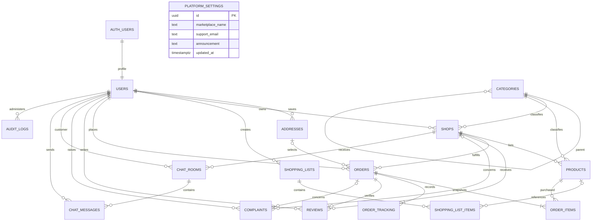

# Database

See [the current functional audit](PROJECT-CHECK-REPORT.md) and [entity mapping](ER-AUDIT-MATRIX.md). Apply all migrations in filename order using `npm run db:migrate`; on existing installations the runner applies only pending migrations and checks installed checksums. Older ER reports are historical.

Auth owns credentials; public profiles never contain password fields. The signup trigger grants only CUSTOMER/SHOPKEEPER. Roles and approval states cannot be self-promoted.

Each product is a shop-specific listing. Historical order items snapshot product name/price; delivery addresses are snapshotted too, so deleting an address does not erase history. Products used by orders are deactivated rather than removed.

Unique constraints/indexes cover email, non-null profile phone (ignoring an optional leading `+`), one default address per customer, one review per order, customer/shop chat room, and customer/idempotency key. Checks cover phone format, coordinates, stock, amounts, snapshot line totals, category cycles and states. Transactions serialize stock reservations/restoration and valid order transitions.

| Resource                 | Customer                   | Shopkeeper     | Admin                  |
| ------------------------ | -------------------------- | -------------- | ---------------------- |
| Approved public catalog  | Read                       | Read           | Manage                 |
| Profiles                 | Own                        | Own            | Manage status          |
| Addresses/lists          | Own                        | No access      | No private read policy |
| Orders/tracking          | Own                        | Own shops      | Read/valid transitions |
| Private chat/images      | Own rooms                  | Own shops      | No access              |
| Reviews                  | Read/create after delivery | Read own shops | Remove                 |
| Complaints               | Own                        | No access      | Resolve                |
| Audit logs               | No access                  | No access      | Read                   |
| Public platform settings | Read                       | Read           | Update, audited        |
| Order reports            | No access                  | No access      | Read aggregates        |

Trigger helpers live in an unexposed `private` schema. Project-owned rate counters were removed; hosted Auth limits remain separate. Security-definer RPCs have fixed empty search paths and fully qualified references. Catalog/avatar Storage buckets are public; chat images require room membership and sender-owned paths. Realtime loads the authenticated session before joining and uses the same RLS read policies. No payment schema exists.
